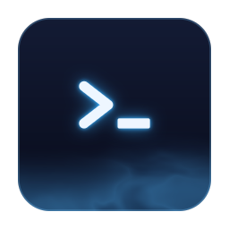

<p align="center">
  
</p>

<h1 align="center">MistTerm</h1>

<p align="center">
  Free team SSH terminal — short-lived certificates, command audit, shared commands, AI batch ops. Rust + GPU UI.
</p>

<p align="center">
  <a href="https://github.com/mistlab-dev/MistTerm/releases/latest"></a>
  <a href="https://mistlab.dev"></a>
  <a href="https://mistlab.dev/docs.html"></a>
  <a href="https://github.com/mistlab-dev/MistTerm/discussions"></a>
  <a href="LICENSE"></a>
</p>

<p align="center">
  <a href="#english">English</a> · <a href="#简体中文">简体中文</a>
</p>

---

<a id="english"></a>

## English

### Install

**End users** — download from [GitHub Releases](https://github.com/mistlab-dev/MistTerm/releases/latest):

| Platform | Package |
|----------|---------|
| **Windows** | `MistTerm-*-windows-x86_64-setup.exe` (installer) or `.zip` |
| **macOS** | `Mist-macos-universal.tar.gz` / `.dmg` when published |
| **Linux** | `Mist-linux-x86_64.tar.gz` |
| **Linux CLI only** (static, any distro, x86_64 / ARM64; 1.2.1+) | `mist-cli-linux-x86_64.tar.gz` / `mist-cli-linux-aarch64.tar.gz`, or `curl -fsSL https://mistlab.dev/install \| bash` |

**From source** (developers):

```bash
git clone https://github.com/mistlab-dev/MistTerm.git
cd MistTerm
./scripts/install.sh          # macOS / Linux → ~/.local/bin/Mist
# .\scripts\install.ps1       # Windows
cargo build --release --bin Mist
```

Details: [docs/en/INSTALL.md](docs/en/INSTALL.md).

### Features

| Area | What you get |
|------|----------------|
| **Terminal** | Async SSH (tokio + ssh2); egui + Alacritty grid; multi-tab / split panes; password, key, agent, Vault CA |
| **Files** | SFTP side panel; ZMODEM (`rz` / `sz`) with progress |
| **Snippets** | Built-in starter commands on first launch; personal library + variables; marketplace; usage analytics |
| **Ops** | Host monitor; port forward (`mist fwd`); batch exec; session logs |
| **CLI** | `mist` headless CLI sharing the same session store — `ls` / `exec` (single + `--group` / `--all` batch) / `ssh` / `rls` / `get` / `put` / `fwd` / `frag` / `import-ssh-config` / `sop extract`. See [docs/tech/CLI-DESIGN.md](docs/tech/CLI-DESIGN.md) |
| **Team** | Free hosted sync at [mistlab.dev](https://mistlab.dev); short-lived certs for small teams; command records |
| **AI** | Multi-host disk/memory/log plans **without** an API key; optional BYO model for chat |
| **Audit** | Records snippets / history / AI / batch (interactive PTY typing not covered yet) |
| **UX** | English / 简体中文; first-launch onboarding; themes; **Activity Rail** (hide with ⌘/Ctrl+B) |

### Quick start

Running the GUI binary `Mist` with **no arguments** launches the desktop UI directly (builds since v1.1.17).

1. Download from [Releases](https://github.com/mistlab-dev/MistTerm/releases/latest) or see the [3-minute guide](https://mistlab.dev/docs.html)
2. Launch **Mist** — onboarding opens once; starter commands are already in the library
3. **⌘N / Ctrl+N** — new session; connect; run a starter snippet (disk / memory)
4. Optional: sign in at mistlab.dev for team certs & audit; try AI “check disk on all servers” (no API key)
5. **⌘K / Ctrl+K** — snippets; Activity Rail — SFTP / Monitor / AI / Forward

Community: [Discussions](https://github.com/mistlab-dev/MistTerm/discussions) · Stories: [mistlab.dev/stories](https://mistlab.dev/stories/)

### Updates & privacy

Mist checks for a new version shortly after it starts and then once a day. It only tells you about it: installing waits for your click, and Mist never restarts on its own. On Linux and Windows you can update with one click; on macOS Mist shows you how to update by hand. From the terminal: `mist update --check`, `mist update` (same as `mist self-update`), and `mist update --rollback`.

The check is a single request to mistlab.dev and GitHub that carries only the Mist version and system type, with no account or device information. As with any website, those servers can see your IP address. Updates are signed and checked before anything is installed. To turn checks off, clear **Preferences → General → Check for updates automatically**, or set `MIST_DISABLE_UPDATE_CHECK=1`, which also blocks manual checks. Details: [docs/release/AUTO_UPDATE.md](docs/release/AUTO_UPDATE.md).

### Documentation

| | |
|---|---|
| [Doc index (EN)](docs/en/README.md) | [Doc index (ZH)](docs/zh/README.md) |
| [Install](docs/en/INSTALL.md) | [Layout / chrome](docs/product/LAYOUT.md) |
| [Terminal behavior](docs/tech/TERMINAL-BEHAVIOR.md) | [User manual (ZH)](docs/manual/MistTerm_操作手册.html) |

### Testing

```bash
cargo test
cargo test --test zmodem_integration_test
```

### Contributing & license

Issues and PRs: [github.com/mistlab-dev/MistTerm](https://github.com/mistlab-dev/MistTerm). **AGPL-3.0** — see [LICENSE](LICENSE). Contributions are accepted under the [contributor license terms](CONTRIBUTING.md#contributor-license-terms). Third-party notices: [resources/THIRD_PARTY_LICENSES.txt](resources/THIRD_PARTY_LICENSES.txt) (also in the app under **About → Open-source licenses**).

---

<a id="简体中文"></a>

## 简体中文

免费的团队 SSH 终端：短时证书、命令审计、共用命令、AI 批量运维。Rust 构建。

官网快速开始：[mistlab.dev/docs.html](https://mistlab.dev/docs.html) · 社区：[Discussions](https://github.com/mistlab-dev/MistTerm/discussions)

### 安装

**普通用户**请从 [GitHub Releases](https://github.com/mistlab-dev/MistTerm/releases/latest) 下载：

| 平台 | 包名 |
|------|------|
| **Windows** | `MistTerm-*-windows-x86_64-setup.exe`（安装包）或 `.zip` 便携版 |
| **macOS** | `Mist-macos-universal.tar.gz` / 发布页中的 `.dmg` |
| **Linux** | `Mist-linux-x86_64.tar.gz` |
| **Linux 只要命令行**（静态版，任意发行版，x86_64 / ARM64；1.2.1 起） | `mist-cli-linux-x86_64.tar.gz` / `mist-cli-linux-aarch64.tar.gz`，或 `curl -fsSL https://mistlab.dev/install \| bash` |

**从源码构建**（开发者）：

```bash
git clone https://github.com/mistlab-dev/MistTerm.git
cd MistTerm
./scripts/install.sh          # macOS / Linux → ~/.local/bin/Mist
# .\scripts\install.ps1       # Windows
cargo build --release --bin Mist
```

详见 [docs/zh/INSTALL.md](docs/zh/INSTALL.md)。

### 功能

| 方向 | 说明 |
|------|------|
| **终端** | tokio + ssh2 异步 SSH；egui + Alacritty 网格；多标签 / 分屏；密码、密钥、Agent、Vault 证书 |
| **文件** | SFTP 侧栏；ZMODEM（`rz` / `sz`）与进度 |
| **片段** | 首次安装自带示例命令；个人命令库与变量；市场模板；使用统计 |
| **运维** | 主机监控；端口转发（`mist fwd`）；批量执行；会话日志 |
| **命令行** | `mist` 无头 CLI，与 GUI 共享同一份会话库——`ls` / `exec`（单机 + `--group` / `--all` 批量）/ `ssh` / `rls` / `get` / `put` / `fwd` / `frag` / `import-ssh-config` / `sop extract`。详见 [docs/tech/CLI-DESIGN.md](docs/tech/CLI-DESIGN.md) |
| **团队** | [mistlab.dev](https://mistlab.dev) 免费托管同步；小团队短时证书；命令记录 |
| **AI** | 多机磁盘/内存/日志计划**无需** API Key；对话可自带模型 |
| **审计** | 覆盖常用命令 / 历史 / AI / 批量（终端手输暂未覆盖） |
| **体验** | 中/英界面；首次新手引导；主题；**活动栏**（⌘/Ctrl+B 可隐藏） |

### 快速上手

GUI 二进制 `Mist` **不带任何参数**运行即直接拉起桌面界面（v1.1.17 起）。

1. 从 [Releases](https://github.com/mistlab-dev/MistTerm/releases/latest) 下载，或看 [3 分钟指南](https://mistlab.dev/docs.html)
2. 启动 **Mist**——首次弹出新手引导，命令库已有示例
3. **⌘N / Ctrl+N** 新建会话并连接，跑一条示例命令（磁盘/内存）
4. 可选：在 mistlab.dev 登录团队开证书与审计；AI 侧栏试「查所有服务器磁盘」（无需 Key）
5. **⌘K / Ctrl+K** 片段；活动栏打开 SFTP / 监控 / AI / 转发

社区：[Discussions](https://github.com/mistlab-dev/MistTerm/discussions) · 案例：[mistlab.dev/stories](https://mistlab.dev/stories/)

### 更新与隐私

Mist 启动后过一会儿检查一次有没有新版本，之后每天检查一次。有新版本只会提醒你，装不装由你点按钮决定，Mist 也不会自己重启。Linux 和 Windows 可以一键更新；macOS 上会告诉你怎么手动更新。命令行里可以用 `mist update --check`、`mist update`（也可以写 `mist self-update`）和 `mist update --rollback`（退回上一个版本）。

检查更新只会向 mistlab.dev 和 GitHub 发一次请求，只带 Mist 版本号和系统类型，不带账号或设备信息。和访问任何网站一样，对方能看到你的 IP 地址。新版本都有签名，安装前会先核对。不想检查的话，可以在 **偏好设置 → 常规** 里取消「自动检查更新」；或者设置环境变量 `MIST_DISABLE_UPDATE_CHECK=1`，这样连手动检查也会关掉。详见 [docs/release/AUTO_UPDATE.md](docs/release/AUTO_UPDATE.md)。

### 文档

| | |
|---|---|
| [中文索引](docs/zh/README.md) | [英文索引](docs/en/README.md) |
| [安装说明](docs/zh/INSTALL.md) | [布局与 chrome](docs/product/LAYOUT.md) |
| [终端行为](docs/tech/TERMINAL-BEHAVIOR.md) | [操作手册](docs/manual/MistTerm_操作手册.html) |

### 测试

```bash
cargo test
cargo test --test zmodem_integration_test
```

### 贡献与许可

Issue / PR：[github.com/mistlab-dev/MistTerm](https://github.com/mistlab-dev/MistTerm)。**AGPL-3.0**，见 [LICENSE](LICENSE)。提交贡献即表示同意[贡献者授权条款](CONTRIBUTING.md#贡献者授权条款中文摘要)。第三方许可声明见 [resources/THIRD_PARTY_LICENSES.txt](resources/THIRD_PARTY_LICENSES.txt)(App 内：**关于 → 开源许可**)。

---

Made with 🦀 — [mistlab.dev](https://mistlab.dev) · [Latest release](https://github.com/mistlab-dev/MistTerm/releases/latest)
