# MistTerm User Manual

> **Version**: 1.0.4  
> **Updated**: 2026-06-18  
> **Website**: [mistlab.dev](https://mistlab.dev) · **Download**: [GitHub Releases](https://github.com/mistlab-dev/MistTerm/releases)

This manual is for users who use MistTerm to connect to servers, work in terminals, and transfer files. It does not cover compiling source code or development; for developer docs, see the `docs/` directory in the repository.

---

## Table of Contents

1. [What is MistTerm](#1-what-is-mistterm)
2. [Installation & Startup](#2-installation--startup)
3. [Quick Start in Five Minutes](#3-quick-start-in-five-minutes)
4. [Interface Overview](#4-interface-overview)
5. [Connecting to Servers](#5-connecting-to-servers)
6. [Using the Terminal](#6-using-the-terminal)
7. [Transferring Files](#7-transferring-files)
8. [Command Snippets](#8-command-snippets)
9. [Monitoring & Port Forwarding](#9-monitoring--port-forwarding)
10. [AI Assistant](#10-ai-assistant)
11. [Team & Sync (Optional)](#11-team--sync-optional)
12. [Command Safety Alerts](#12-command-safety-alerts)
13. [Credentials, Logs & Preferences](#13-credentials-logs--preferences)
14. [Keyboard Shortcuts](#14-keyboard-shortcuts)
15. [FAQ](#15-faq)

---

## 1. What is MistTerm

MistTerm is an **SSH terminal client** that helps you:

- Save multiple server connections and open terminals with one click
- Upload and download files via a graphical interface (SFTP)
- Save frequently used command templates (snippets) to avoid repetitive typing
- Monitor server CPU, memory, disk, and more
- Optional: AI-assisted command explanation, team-shared snippets

Supports **Windows** and **macOS**.

---

## 2. Installation & Startup

### 2.1 Download & Install

1. Go to [GitHub Releases](https://github.com/mistlab-dev/MistTerm/releases)
2. Download the installer for your system:
   - **Windows**: `MistTerm-*-windows-x86_64-setup.exe`, double-click to install
   - **macOS**: `.dmg`, drag into the Applications folder
3. Launch **Mist** (or MistTerm) from the Start menu / Launchpad

No separate OpenSSH installation is required; you can connect to remote Linux servers right away.

### 2.2 First Launch

On startup, the main window appears: the left side shows the **session list**, the center is the **workspace** (terminal appears after connecting), the top has the **menu bar**, and the bottom has the **status bar**.

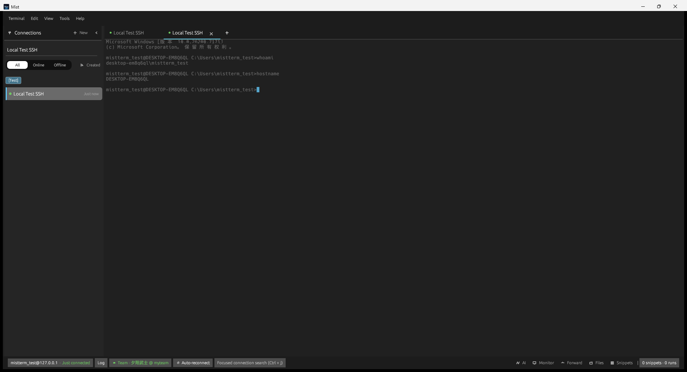

*Fig 2-1: Main interface with an active SSH connection*

### 2.3 Where Data Is Stored

Connections, passwords, snippets, and other configuration are stored locally in your user directory (encrypted), for example:

- Windows: `%APPDATA%\mistterm\`
- macOS: `~/Library/Application Support/mistterm/`

Do not edit these files manually; use the in-app interface to make changes.

---

## 3. Quick Start in Five Minutes

| Step | Action |
|------|--------|
| 1 | Press **Ctrl+N** (Mac: **⌘N**) to open "New Session" |
| 2 | Fill in name, host IP/domain, port (default 22), username, password or key |
| 3 | Click **Save & Connect**, or **double-click** the session in the sidebar |
| 4 | Type commands in the terminal, e.g. `ls`, `cd`, `top` |
| 5 | To transfer files: menu **View → SFTP**, or click **Files** in the bottom bar |

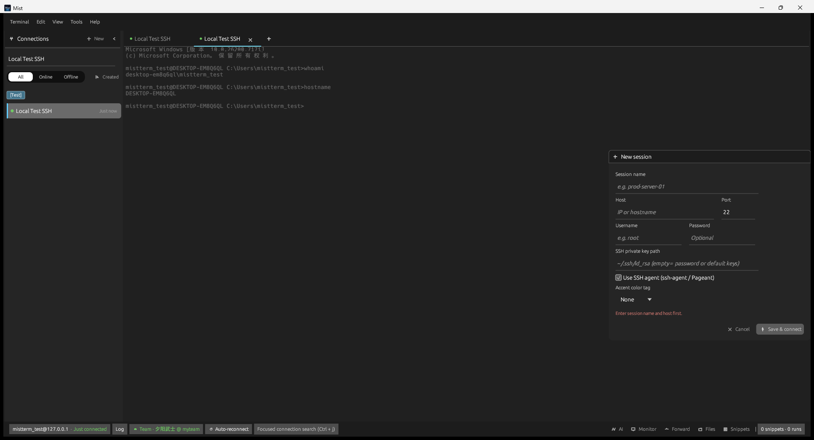

*Fig 3-1: New Session*

---

## 4. Interface Overview

### 4.1 Layout

| Area | Location | Description |
|------|----------|-------------|
| Top menu bar | Top of window | **Terminal**, **Edit**, **View**, **Tools**, **Help** |
| Session list | Left sidebar | Saved connections, supports grouping and search |
| Workspace | Center | Terminal tabs; type commands here after connecting |
| Side panels | Right (on demand) | SFTP, Monitor, Snippets, AI, etc. |
| Status bar | Bottom of window | Connection info and quick access: **AI** / **Monitor** / **Forward** / **Files** / **Snippets** |

### 4.2 Common Actions

| What you want | How to open |
|----------------|-------------|
| New/Edit connection | **Ctrl+N** / select in sidebar then **Ctrl+E** |
| Open SFTP | **View → SFTP** or bottom bar **Files** |
| View CPU/Memory | **View → Monitor** or bottom bar **Monitor** |
| Command snippets | **Ctrl+K** or bottom bar **Snippets** |
| AI Assistant | **Ctrl+Shift+A** or bottom bar **AI** |
| Preferences | **Ctrl+,** |
| Help & shortcuts | **Help → Quick Start / Keyboard Shortcuts** or **Ctrl+H** |

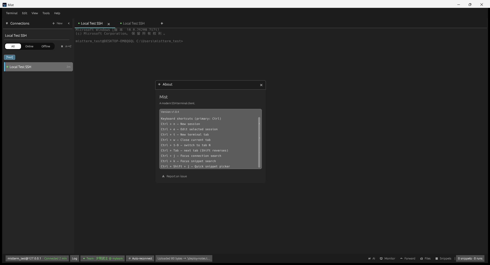

*Fig 4-1: Sidebar session list (groupable, searchable)*

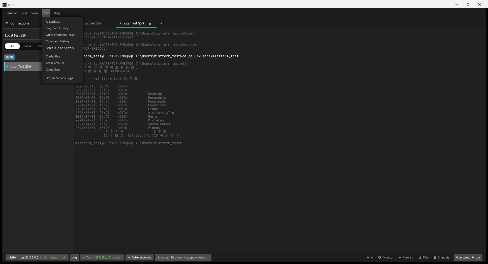

*Fig 4-2: View menu — toggle side panels*

---

## 5. Connecting to Servers

### 5.1 Creating a New Session

1. **Ctrl+N** to open the dialog
2. Fill in:
   - **Session Name**: for easy identification, e.g. "Prod Web-01"
   - **Host**: IP or domain
   - **Port**: usually 22
   - **Username**
   - **Password** or **private key file path**
3. Optional: uncheck "Use SSH Agent" if using password-only login
4. Click **Save & Connect**

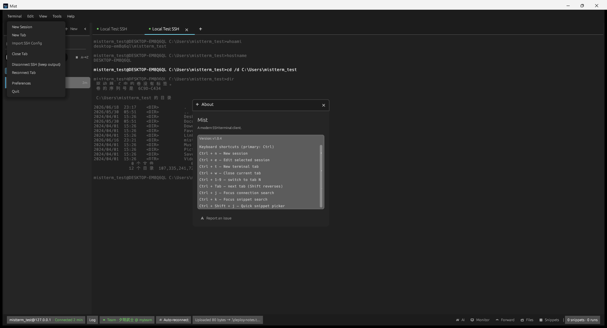

*Fig 5-1: You can also use **Terminal → Import SSH Config** to batch-import from an existing `~/.ssh/config`*

### 5.2 Authentication Methods

| Method | Use Case |
|--------|----------|
| Password | Server allows password login |
| Private key file | Local `.pem` / `id_ed25519`, etc. |
| SSH Agent | ssh-agent / Pageant running with key loaded |
| Jump host | Configure ProxyJump in advanced options (same as OpenSSH) |

### 5.3 Connecting & Reconnecting

- **Connect**: click a session in the sidebar → **Ctrl+T** for a new tab, or **double-click** the session
- **Search sessions**: **Ctrl+J** to focus the sidebar search box
- **Auto-reconnect**: enable KeepAlive / auto-reconnect in session settings
- The bottom bar shows `username@host · Connected` when successful

### 5.4 Local Data Security

Passwords and session info are **encrypted locally**. When switching computers, you need to reconfigure or restore from backup. Config files are in encrypted format — opening them in a text editor will show garbled characters, which is normal.

---

## 6. Using the Terminal

### 6.1 Basic Operations

- After connecting, type commands in the terminal area and press **Enter** to execute
- **Select text with the mouse** to copy; **Ctrl+V** to paste (Mac: **⌘V**)
- Supports colored output, vim, htop, and other common TUI programs
- Tabs: **Ctrl+T** for new tab; **Ctrl+W** to close current tab; **Ctrl+Tab** to switch tabs

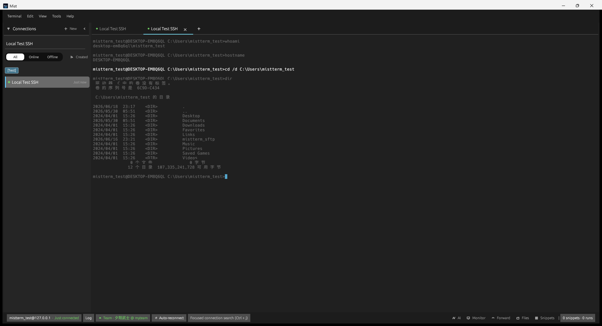

*Fig 6-1: Running commands in the terminal*

### 6.2 Find & History

- **F3** or **Ctrl+F**: search text in terminal output


*Fig 6-2: Find in terminal*

- **Ctrl+R** (when terminal is focused): search and re-run history commands
- **Tools → Command History**: browse recently executed commands

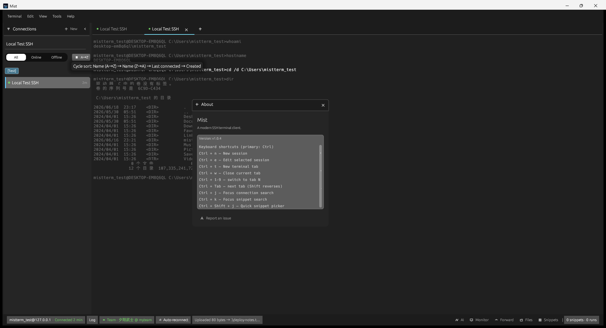

*Fig 6-3: Command history window*

### 6.3 Split Panes (Multiple Panes in One Tab)

- **Ctrl+Shift+D**: split left/right
- **Ctrl+Shift+U**: split top/bottom
- **Alt+← / Alt+→**: switch focus between split panes

---

## 7. Transferring Files

### 7.1 SFTP Panel (Recommended)

**Open via**: menu **View → SFTP**, or bottom bar **Files**.

The interface has two panes — **Local** and **Remote**:

1. Use the path input at the top to navigate directories (press Enter to go)
2. Click to select files or folders
3. Use toolbar buttons or right-click menu: **Upload**, **Download**, **Delete**, **New Folder**, **Rename**
4. Results are shown in the **bottom status bar**

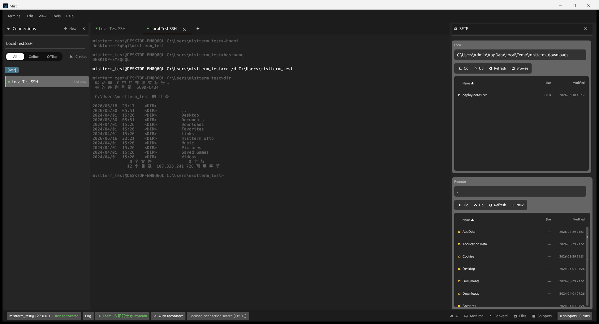

*Fig 7-1: SFTP dual-pane file management*

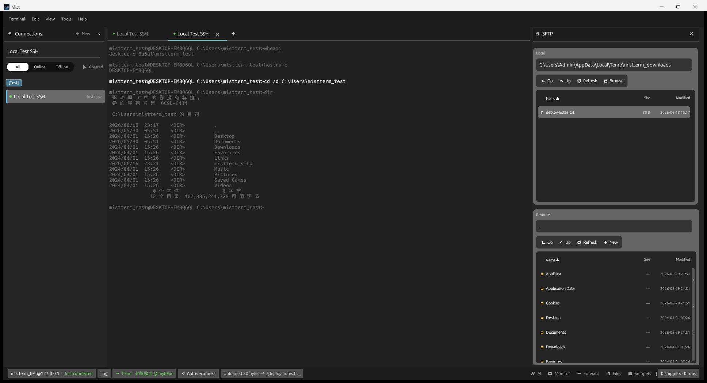

*Fig 7-2: Bottom bar confirmation after upload*

**Typical workflow — uploading a file to a server:**

1. After connecting via SSH, open the SFTP panel
2. In the left local pane, navigate to the file you want to upload
3. In the right remote pane, navigate to the target directory
4. Select the local file → Upload

**Download** works in reverse: select a remote file → Download to the current local directory.

### 7.2 ZMODEM in Terminal (rz / sz)

If the server has `lrzsz` installed, you can use these commands in the terminal:

```bash
# Upload a file from local to the current remote directory (follow the prompt to select a file)
rz -bye

# Download a file from remote to local
sz filename
```

MistTerm will automatically handle the transfer and show progress. If transfers fail, make sure the remote side uses `rz -bye`, and check whether a firewall is interrupting long connections.

---

## 8. Command Snippets

Save frequently used commands as **snippets** for one-click insertion. Supports `<variable>` placeholders.

### 8.1 Opening Snippets

| Method | Description |
|--------|-------------|
| **Ctrl+K** | Focus snippet search |
| **Ctrl+Shift+J** | Quick snippet selector |
| Bottom bar **Snippets** | Open the snippet side panel |
| **Tools → Snippet Library** | Manage, create, and edit snippets |

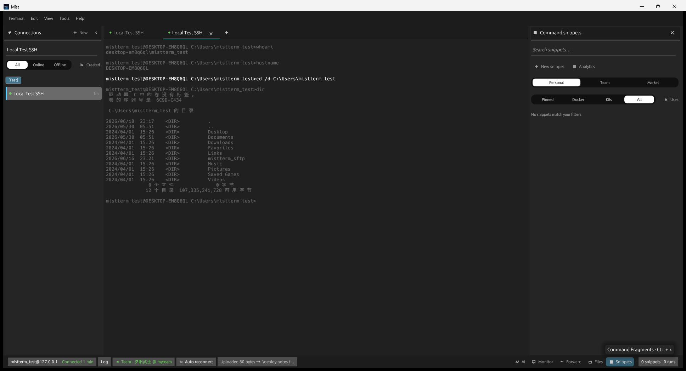

*Fig 8-1: Snippet panel opened from bottom bar*

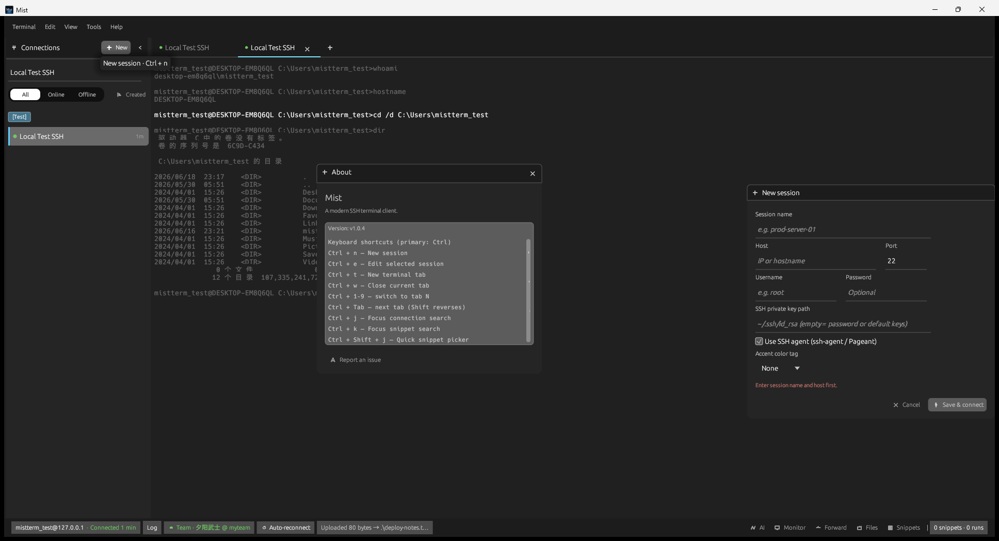

*Fig 8-2: Snippet Library — create and edit*

### 8.2 Using Variables

Example snippet content:

```bash
kubectl logs -f deployment/<service> -n <namespace>
```

When executed, an input dialog appears for each variable. After filling them in, the command is automatically substituted and sent to the terminal.

### 8.3 Team Snippets

If you are logged into a MistLab team account, you can use team-shared snippets (see Section 11).

---

## 9. Monitoring & Port Forwarding

### 9.1 Host Monitoring

1. First establish an SSH connection
2. Open **View → Monitor** or bottom bar **Monitor**
3. View CPU, memory, disk, load charts (data is read-only, collected from the remote server)


*Fig 9-1: Host monitoring*

> Monitoring depends on the SSH connection. If the connection drops, charts stop updating; reconnect to resume.

### 9.2 Port Forwarding

1. Open bottom bar **Port Forward** or **View → Port Forwarding**
2. Add rules (format similar to OpenSSH):
   - **Local forward**: `local_port:target_host:target_port`
   - **Remote forward**: `remote_port:target_host:target_port`
   - **SOCKS proxy**: port number
3. Rules take effect when the session is connected


*Fig 9-2: Port forwarding management*

---

## 10. AI Assistant

### 10.1 Initial Configuration

1. **Tools → AI Settings** (or press **Ctrl+Shift+A** to open the panel first, then enter settings)
2. Fill in **API URL**, **API Key**, and **Model Name** (must be compatible with OpenAI-style API, such as various API gateways)
3. Save

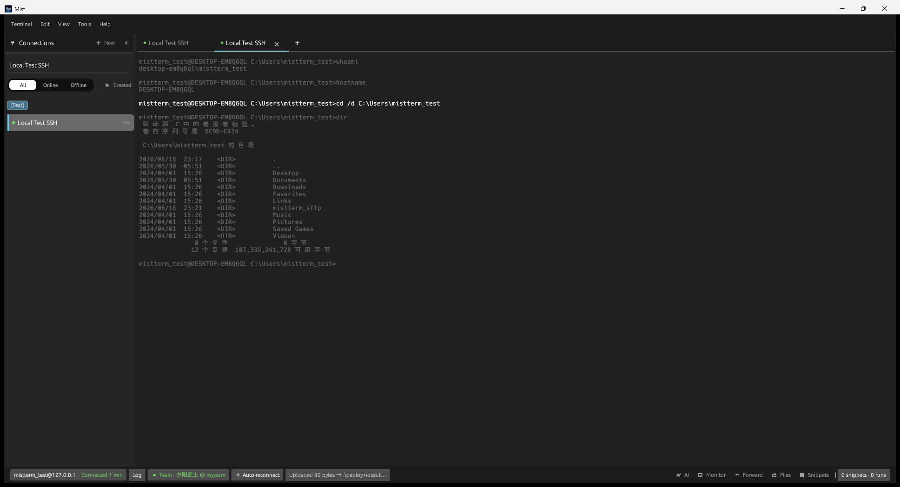

*Fig 10-1: AI Settings*

### 10.2 Usage

- **Ctrl+Shift+A** opens the AI panel; type your question and send
- **Ctrl+Shift+L**: send selected text from the terminal to AI for analysis
- Requests go directly to your configured API — **they do not pass through MistLab servers** (key is stored locally)

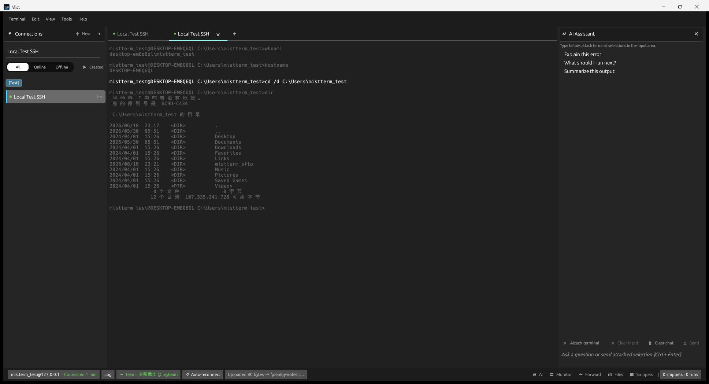

*Fig 10-2: AI assistant conversation*


*Fig 10-3: Tools menu — AI, Snippets, Batch Execute, Credentials, etc.*

---

## 11. Team & Sync (Optional)

For users of **MistLab Team Edition**:

1. **Tools → Team Account** to log in (browser OAuth authorization)
2. After logging in, you can:
   - Sync/share command snippets
   - View team audit records (if enabled by admin)
   - Use team Vault credentials (if configured)
3. **Tools → Cloud Sync** can back up personal configuration to a Git repository (optional)

Without a team login, all personal features work normally.

---

## 12. Command Safety Alerts

MistTerm can warn or block dangerous commands **before** they are sent to the server (depending on your rules and team policies):

| Behavior | Description |
|----------|-------------|
| Block | Extremely high-risk commands like `rm -rf /` cannot be sent |
| Confirm | A dialog asks "Are you sure?" |
| Alert | Execution allowed but a warning is logged |

View or adjust local rules in **Preferences**. When joining a team, admin-pushed policies sync to your machine.

---

## 13. Credentials, Logs & Preferences

### 13.1 Credential Management

**Tools → Credentials**: centrally stores server accounts, database credentials, API tokens, etc., referenced by sessions or snippets. Encrypted locally by default.

### 13.2 Session Logs

Enable **Session Logging** in Preferences to automatically save terminal interaction records for later auditing. View via **Tools → Browse Session Logs**.

### 13.3 Preferences & Themes

- **Ctrl+,** opens Preferences: interface language, theme, font, audit, logging, etc.

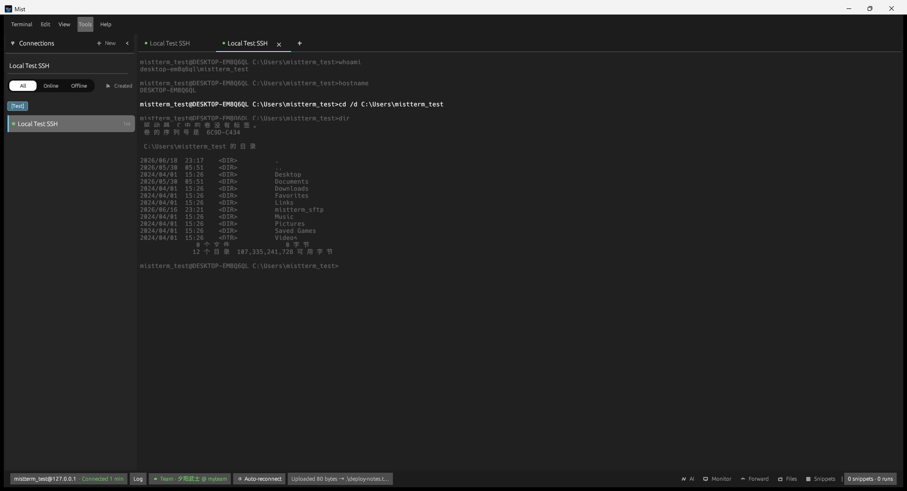

*Fig 13-1: Preferences*

- **Ctrl+H** to view About and built-in shortcut guide


*Fig 13-2: About Mist*

- **View → Theme**: switch between dark/light and other color schemes

### 13.4 Batch Execution

**Tools → Batch Execute**: select multiple saved hosts, enter a command, and execute it in parallel across all selected hosts. Useful for inspections (results are shown per host; overly long output is auto-truncated).

---

## 14. Keyboard Shortcuts

The following uses **Windows** keys; on macOS, replace **Ctrl** with **⌘** (e.g., Ctrl+N → ⌘N).

| Shortcut | Function |
|----------|----------|
| **Ctrl+N** | New session |
| **Ctrl+E** | Edit selected session |
| **Ctrl+T** | New terminal tab for selected session |
| **Ctrl+W** | Close current tab |
| **Ctrl+Tab** / **Ctrl+Shift+Tab** | Next / previous tab |
| **Ctrl+1 … Ctrl+9** | Switch to tab N |
| **Ctrl+J** | Focus connection search (sidebar) |
| **Ctrl+K** | Focus snippet search |
| **Ctrl+Shift+J** | Quick snippet selector |
| **Ctrl+F** / **F3** | Find in terminal |
| **Ctrl+R** | Command history search (in terminal) |
| **Ctrl+Shift+A** | AI assistant panel |
| **Ctrl+Shift+L** | Send terminal selection to AI |
| **Ctrl+Shift+D** / **Ctrl+Shift+U** | Split terminal left/right / top/bottom |
| **Ctrl+,** | Preferences |
| **Ctrl+H** | About & shortcut guide |
| **Esc** | Close current dialog or menu |

For the complete list, refer to the in-app **Help → Keyboard Shortcuts**.


*Fig 14-1: In-app Help — Quick Start*

---

## 15. FAQ

### Cannot connect to server

- Check host, port, username, password/key
- Confirm your network can reach the target IP (try `ssh` from your system first)
- If a jump host is needed, configure ProxyJump in session advanced options
- Check the bottom bar for error messages

### Terminal is blank or shows garbled text after connecting

- Wait a few seconds for the shell to initialize
- Verify language and font in Preferences; Chinese environments generally auto-select an appropriate font

### SFTP cannot upload/download

- Confirm SSH is connected (same tab)
- Check write permissions on the remote directory
- Verify the local target path exists and is not read-only

### ZMODEM (rz/sz) transfer fails

- Confirm `lrzsz` is installed on the server (`which rz`)
- Use `rz -bye` for uploads
- Do not switch tabs or disconnect during transfer

### Config file appears as garbled text

- Normal behavior: MistTerm encrypts local configuration; modify settings only within the app

### How to uninstall

- **Windows**: Settings → Apps → MistTerm → Uninstall
- **macOS**: Drag MistTerm to Trash; configuration remains in `Application Support/mistterm/` and can be deleted manually

### How to report issues

Go to [GitHub Issues](https://github.com/mistlab-dev/MistTerm/issues) and describe the problem, version, and OS. Do not paste passwords or keys in issues.

---

*MistTerm v1.0.4 User Manual · MistLab*
