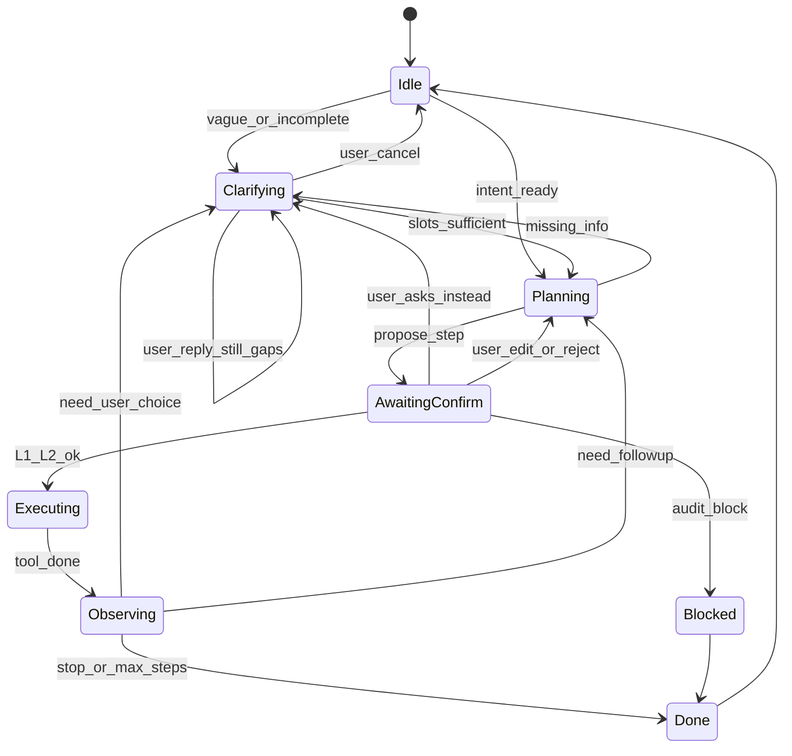
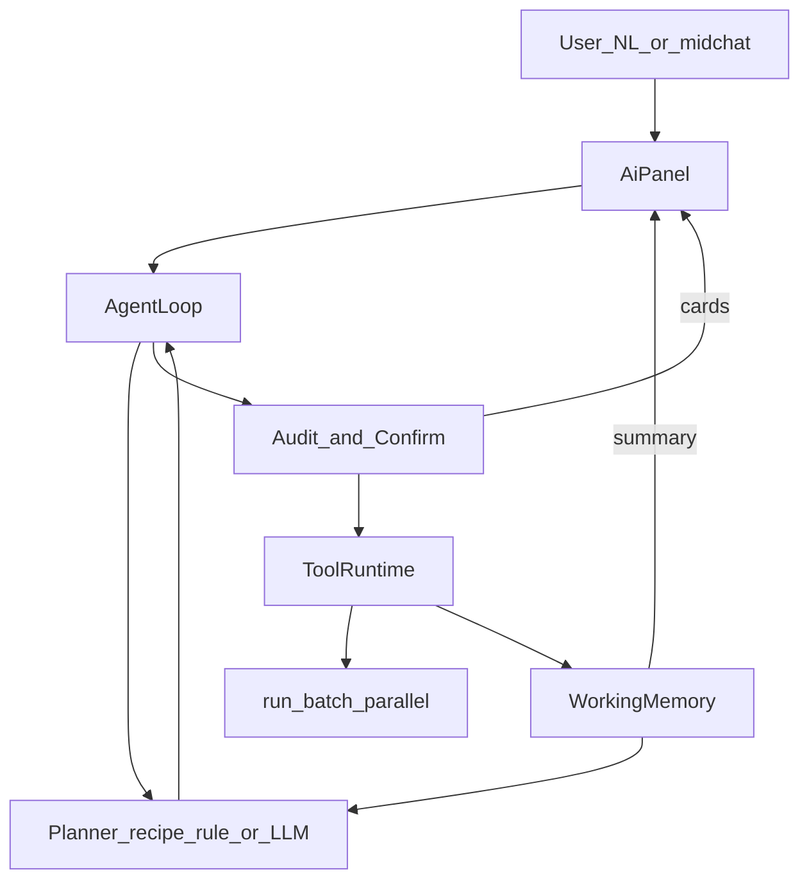

# 对话驱动下一代终端（设计稿）

> 状态：调研完成 · **归入 v2.0 大版本，与 v1.1.3 发版分离** · 待单独立项实现  
> 日期：2026-09-05  
> 关联：[`AI-INTERACTION-DESIGN.md`](../tech/AI-INTERACTION-DESIGN.md)、[`batch_exec`](../../src/core/batch_exec.rs)、概念稿 v4  
> **UI 决策（2026-09-05）**：默认**沿用现有壳**（左会话 · 中终端 · 右 Dock AI），不另开「对话运维」全屏模式；能力加在右栏 AI 上。  
> **范围决策（2026-09-05）**：**选项 B — 只读 + 受控变更**。只读巡检/排查为默认能力；变更类（如 restart / rollout）走**显式白名单**，强制 L2，默认仍偏保守。不做无人值守自愈（否决选项 C）。  
> **抽象决策（2026-09-05）**：运维动作以 **Skill（技能）** 组织——不是散落的临时 shell，而是「可发现、可门闩、可多步」的能力包；对话 Agent 负责选 Skill / 填槽 / 按步执行。

---

## 1. 一句话

**对话驱动意图、SSH 为执行层，界面仍是 MistTerm**：用户在右侧 AI 下运维意图；本地 **Agent 循环**（提议 → 确认 → 执行 → 观察 → 再提议）驱动多机 SSH；步骤可随结果动态分支。中间终端 Tab 照常用于交互式操作。

示例：

> 用户（右栏 AI）：查下所有服务器上剩余磁盘空间  
> 系统：确认目标（本地会话 ∪ 当前团队服务器，共 N 台）→ 并行 `df -h` → 对话里表格汇总 + 一句话结论

---

## 2. 与现状的关系

| 能力 | 今天 | 下一代 |
|------|------|--------|
| AI 面板 | 聊天 →「用到终端」打**当前一台** | 同面板可触发 **多机工具**，结果回对话 |
| 批量执行 | Tools → 手选主机 + 手输命令 | 由对话编排调用同一 `run_batch_parallel` |
| 监控 `df` | 已连接会话单机采集 | 批量结果可复用 `parse_disk` 结构化 |
| 产品壳 | 终端为主 + 右 Dock AI | **沿用同一布局**；仅增强 AI 气泡（计划卡 / 进度 / 汇总） |

**非目标（本设计明确不做）**

- 不做手机交互式终端  
- 不做「绕过审计」的自动执行；危险命令仍走本地/服务器策略  
- 不做完全取代经典终端（交互式 vim/top、长驻 PTY 仍用 Tab）  
- MVP **不做**顶栏「经典 / 对话运维」双模式换壳（可选远期增强）  
- 第一期不做任意开放式 Agent 上网/装包；工具白名单制

---

## 3. 产品形态：沿用现有界面

```text
┌────────┬──────────────────────────────┬─────────────────────┐
│ 会话    │  终端（SSH 输出 + 输入行）      │  AI 面板（右 Dock）   │
│ 侧栏    │  交互式操作照旧               │  · 普通问答 / 用到终端 │
│        │                              │  · 多机意图：计划卡    │
│        │                              │  · 执行进度 / 汇总表  │
└────────┴──────────────────────────────┴─────────────────────┘
```

与 [`AI-INTERACTION-DESIGN.md`](../tech/AI-INTERACTION-DESIGN.md) 一致：**一个右侧 AI 窗口**，不另做全屏对话壳。

### 3.1 右栏增量（相对今天）

| 元素 | 说明 |
|------|------|
| 计划确认卡 | 展示命令、目标主机数（可「改目标」打开精简勾选）、[确认执行] [取消] |
| 进度条/行 | `8/12 完成`，失败主机点开看错误 |
| 汇总气泡 | Markdown 表或要点；折叠「按主机原始输出」 |
| 「用到终端」 | 单机命令仍可用；多机路径走批量，不强制写入当前 Tab |

目标主机：默认「本地已存会话 ∪ 当前团队服务器」；勾选可复用现有批量执行的目标列表 UI（弹层或对话内嵌），不必新开左栏。

原则：

1. **先计划后执行**（默认）：意图 → 计划卡 → 用户确认 → 再 SSH。  
2. **结果必须回对话**：不只弹批量窗；对话里给结构化摘要。  
3. **审计优先**：批量路径复用 `CmdAuditEngine`；Block 拒跑；Confirm 在对话里二次确认。  
4. **来源标明**：汇总若含模型润色，标明「模型摘要」；原始输出可展开。

### 3.2 远期可选（非 MVP）

若对话成为主工作流、右栏不够用，再评估「加宽 AI / 临时最大化 AI」或独立对话运维页；**不以换壳为 Phase 1 前提**。

---

## 4. 架构：动态编排（核心）

执行逻辑**默认按动态**设计，而不是「写死一条 df 流水线」。固定配方只是动态循环里的一种**种子计划**。

### 4.0 一句话模型

```text
用户意图（可能很含糊）
  → 不够清楚？先多轮对话澄清（Ask），不碰 SSH
  → 够清楚？提出「下一步执行」
  → 门闩（审计 + 确认阶梯）
  → 执行 tool（SSH/汇总）
  → 写入观察
  → 再澄清或再提议……直到结束或用户取消
```

两件事都是动态的，且可以**交织**：

| 循环 | 产出 | 是否 SSH |
|------|------|----------|
| **澄清循环** | 问句 / 选项 / 填槽 | 否 |
| **执行循环** | `StepProposal` → 确认 → tool | 是（过门闩后） |

用户可能聊了十几轮才说清范围，中间改主意、插话、否定上一步——都正常。系统不假设「第 N 轮固定弹出某张卡」。

**动态**指：澄清轮次不固定；每一步的命令与目标可随观察与用户话变化。  
**执行时机**（产品默认，见 §4.0.1）：**边聊边按步执行**——只对「当前已确认的那一步」开 SSH；不是聊完全部细节后再一次性连上狂跑，也不是每句闲聊都连服务器。

**不动态**的仍是门闩：白名单/审计/L0–L2、目标只缩不扩、步数与澄清轮次上限。

### 4.0.1 边聊边执行，还是聊完再 SSH？

| 模式 | 含义 | 本设计 |
|------|------|--------|
| 聊完再执行 | 槽位全部填满、整条计划谈妥后，才第一次 SSH | ❌ 不做默认（探活/列 ns 也要先聊完会很钝） |
| 每句都执行 | 用户每发一句话就自动连机跑命令 | ❌ 禁止（无确认、易误伤） |
| **按步交织（默认）** | 够跑**当前一步**就 L1→SSH；结果回来继续聊；再够下一步再 SSH | ✅ |

示意时间线（kubectl 例）：

```text
聊：哪台？ → 聊：只要 prod
── SSH #1：kubectl get pods -n prod（用户点了确认）──
聊：186 太多，先抽样 20
── SSH #2：对 20 个 exec df（再次确认）──
聊：阈值改成 85% 再看全量？ → …
```

因此：

- **「边聊边执行」** = 对话与 SSH **交替**，以「一步一确认」为边界。  
- **「聊完再执行」**仅作可选：用户说「先别连，把计划都列出来」→ 多轮只 Clarifying / 预览整链，点「开始执行」后再进入逐步 L1（Phase 3+ 可做「整计划预览」）。  
- 未确认的计划卡、纯问答、改槽位 → **零 SSH**。

### 4.0.2 SSH 连接何时建立 / 释放？

对话路径的执行默认走 **exec 短连接**（与今日 `batch_exec` 一致：`connect → exec_command → disconnect`），**不占用**中间终端 Tab 的长驻 PTY。

| 时刻 | 连接行为 |
|------|----------|
| Clarifying / 纯聊天 / 计划卡未点确认 | **不建连** |
| 用户确认某一步且过门闩 | 对该步涉及的每台目标：**建连 → 跑该步命令 → 立即 disconnect** |
| 同 Run 下一步（可能隔了几轮聊天） | **重新建连**（不默认把上一轮连接挂着等用户想完） |
| 一步内多主机并行 | 每主机独立短连接；该主机命令结束后释放 |
| 一步内同机多次 exec（如 186 次 kubectl exec） | 见下方「同机多命令」 |
| Run 结束 / 用户点「结束任务」/ 取消 | 无残留 agent 连接（短连接模式无需额外释放） |
| 用户另开的终端 Tab | **独立生命周期**；agent 不替 Tab 断连，也不复用 Tab 的 PTY |

**同机多命令（kubectl 扫容器）**

- **默认（稳）**：整步共用**一条**短会话：确认后 `connect` → 会话内串行/有限并行跑模板命令 → 步结束 `disconnect`。聊天间隙不占连接。  
- **可选（快）**：`AgentRun` 级连接池——同主机在 Run 活跃期间保活，**空闲超时**（如 60s 无下一步 exec）或 Run `Done`/取消时释放；需心跳与断线重连。Phase 2+ 再做，Phase 1 不必。

**不采用**

- 澄清阶段就连上「占着茅坑」等用户想清楚  
- 聊完才建一条超长会话把整条链跑完且中途不释放（难取消、难审计边界）  
- agent 静默劫持用户正在用的交互式 Tab

**与「边聊边执行」的关系**：聊的时候连接是释放的；只有点了确认的那一步窗口内才持有连接，步结束即断（或池化时仅在 Run 内短时保活）。

### 4.1 运行时状态机



| 状态 | 含义 |
|------|------|
| `Idle` | 无进行中的 Run |
| `Clarifying` | **人在对话补信息**；可发问、给选项；**不执行** SSH |
| `Planning` | 槽位够了（或用户说「先按默认」），生成下一步 `StepProposal` |
| `AwaitingConfirm` | 计划卡等人；用户也可打字改需求 → 回 Clarifying/Planning |
| `Executing` / `Observing` | 执行与写 memory |
| `Blocked` / `Done` | 拦截或结束 |

要点：澄清**不是**固定问卷向导；同一 `AgentRun` 里可以 Clarifying ↔ Planning ↔ Observing 来回跳。计划卡上的按钮只是快捷回复，等价于用户发一条消息。

### 4.2 核心数据结构（逻辑）

```text
AgentRun
  intent_raw:         历次用户原话（可追加）
  slots:              结构化槽位（见 4.8），未知则为 null
  approved_targets:   已批准主机全集（后续 ⊆）
  memory:             WorkingMemory
  clarify_rounds / max_clarify_rounds
  step_index / max_steps
  mode:               recipe | adaptive

WorkingMemory
  observations[] / facts / user_notes

ClarifyTurn           // Clarifying 的产出（不是 StepProposal）
  question:           自然语言问题
  options?:           快捷选项（按钮）
  slot_keys:          本轮想填哪些槽
  blocking:           true=缺了就不能进 Planning

StepProposal          // 仅 Planning→执行用
  command / targets|selector / rationale / risk_hint / stop
```

### 4.3 三种计划来源（都喂进同一循环）

| 来源 | 动态程度 | 何时用 |
|------|----------|--------|
| **A. Skill / 静态配方** | 低：种子步骤固定，跟进可仍动态 | MVP：`disk.usage` → `df -h`；实现快、可测 |
| **B. 规则自适应** | 中：Skill 内 `if WARN then propose du` | Phase 2：多步跟进 |
| **C. LLM 规划** | 高：每轮看 memory 选/组合 Skill 或填槽 | Phase 3；仍经同一门闩 |

### 4.3.1 和「Skill」的关系（正名）

前面说的「只读配方 / 变更白名单 / 运维包」，产品上就是 **Skill**：

```text
Skill = 命名能力包
  id / 标题 / 触发说法（NL 或 /命令）
  风险档：readonly | mutate
  槽位：host、ns、unit、threshold…
  步骤模板或小型状态机（可动态 propose_next）
  门闩策略：L1 / L1+L2；是否允许对话路径
```

| 概念 | 对应 |
|------|------|
| 查全机磁盘 | Skill `host.disk_usage`（readonly） |
| 磁盘高再 du | 同一 Skill 的跟进步，或 `host.disk_du_followup` |
| kubectl 高磁盘容器 | Skill `k8s.container_disk_hot`（readonly，多步） |
| 重启 nginx | Skill `host.systemctl_restart`（mutate，须开设置 + L2） |

Agent **不是**自由生成任意 shell 的万能脚本机；默认是 **选 Skill → 填槽 → 逐步确认执行**。  
LLM 的价值：理解含糊话、填槽、在 Skill 目录里选型、写跟进理由——**不**绕过 Skill 门闩去「临时发明」高危命令（选项 B）。

与 Cursor/IDE 的 Agent Skill 不同：这里是 **MistTerm 运行时 Skill**（SSH 执行层），可内置在客户端，后续也可团队分发（类片段/知识，但是可执行能力包）。

静态「配方」= Skill 的一种实现；变更白名单 = mutate Skill 的允许列表。

### 4.4 循环伪代码

```text
run = new AgentRun(intent, approved_targets)
loop:
  proposal = planner.next(run.intent, run.memory, run.mode)  // A/B/C
  if proposal.stop or run.step_index >= max_steps:
    show_final_summary; break
  resolve targets = proposal.target_ids or eval(selector, memory)
  targets = intersect(targets, run.approved_targets)  // 只缩不扩
  gate = audit(proposal.command) + confirm_ladder(L1/L2)
  if gate.block: break
  if user.reject: break or re-plan
  rows = run_on_hosts(targets, command)
  memory.push(observe(rows))
  run.step_index += 1
  // 可选：自动进入下一轮 Planning（仍要确认卡），或停住等用户点「继续跟进」
```

**默认 UX**：每步执行完停在对话里，展示汇总 +「建议下一步」卡；用户点确认才进入下一步（动态，但人在环上）。  
设置项（后期）：「只读链自动续提议」——自动弹出下一步卡，**仍要人点确认**才 exec。

### 4.5 动态边界（防「越编越飞」）

| 边界 | 默认 |
|------|------|
| `max_steps` / Run | 如 5；超出必须用户明确「继续」并提高上限 |
| 单步主机数 | 复用批量上限；跟进步默认 ≤ 上一步命中数 |
| 命令来源 | MVP：配方/规则模板；LLM 仅可填模板槽位或白名单命令族 |
| 目标扩容 | 禁止；要加机器必须用户改勾选并重新 L1 |
| 变更类 | 默认整条对话路径关闭；开启后每步 L2 |
| 失败策略 | 单主机失败记录在 memory；不默认对失败机改跑破坏性补救 |

### 4.6 模块与 Tool



| 模块 | 职责 |
|------|------|
| `src/core/agent/run.rs` | `AgentRun` / 状态机 / max_steps |
| `src/core/agent/memory.rs` | 观察与 facts |
| `src/core/agent/planner.rs` | 配方 / 规则自适应 / LLM 提议 |
| `src/core/agent/gate.rs` | 白名单 + `CmdAuditEngine` + L0–L2 |
| `src/core/agent/summarize.rs` | df/free 等结构化 |
| `src/ui/ai_panel.rs` | 计划卡、进度、汇总、中途改意图 |

| Tool | 参数 | 底层 |
|------|------|------|
| `list_targets` | scope / tags | `build_batch_targets` |
| `run_on_hosts` | command, target_ids, parallel | `run_batch_parallel`（含 ProxyJump） |
| `summarize_*` | rows | 本地结构化 |
| `propose_next` | （内部）由 planner 调用 | 只产出 `StepProposal`，不执行 |

### 4.7 规划实现分期

| 阶段 | Planner | 动态性 |
|------|---------|--------|
| Phase 1 | 配方种子 + 单步结束；**简单槽位澄清**（主机未匹配时问一句） | 用户可再问开启续 Run |
| Phase 2 | 规则自适应 + **多轮澄清**（缺 ns/范围就 Ask，不固定轮数） | 真多步 + 人机来回说清 |
| Phase 3 | LLM 澄清与 `StepProposal` 交织；中途改意图 | 开放动态；门闩不变 |

MVP 不依赖网关 function-calling；Phase 3 再接 `tools` 协议（若可用）。

### 4.8 多轮澄清（说很多轮才明白）

**结论：能搞定。** 交互不固定轮次；「说清楚」是状态，不是第 N 张必现卡片。

#### 槽位，不是剧本

以 kubectl 场景为例，slots 逐步填满即可进执行（顺序随意）：

| 槽 | 必填？ | 示例填法（可能分散在很多轮） |
|----|--------|------------------------------|
| `host` | 是 | 「xxx」「刚才那台堡垒」 |
| `ns_scope` | 建议 | 「先 prod」「全部」「你看着办」 |
| `disk_threshold` | 有默认 | 默认 90，用户可改 |
| `ip_kind` | 有默认 | 默认 Pod IP |
| `exec_scope` | 高影响前必填 | 「先 20 个」「全量我确认了」 |

未填必填槽 → 只产出 `ClarifyTurn`，**禁止**生成会 SSH 的 `StepProposal`。  
用户也可以说「别问了，按你的默认开始」→ 用默认填槽 → Planning。

#### 和普通 AI 闲聊怎么区分

右栏仍是一个输入框。路由规则：

1. 若存在未完成的 `AgentRun` 且状态为 Clarifying / AwaitingConfirm / Observing → 用户话优先当作**对该 Run 的回复**（补槽、改主意、取消、确认）。  
2. 否则若命中运维意图（规则或 LLM）→ 新建 `AgentRun`。  
3. 否则走现有普通问答 /「用到终端」（不进 Agent 门闩）。

确认卡上的按钮 = 预填一条用户消息（「全部 ns」「取消」），方便但不强制；用户永远可以自由打字。

#### 乱七八糟的真实对话（示意）

```text
用户：帮我看看容器磁盘
助手：哪台机器？阈值？（Clarify）
用户：就是上次那个 k8s 节点吧，阈值先不管
助手：会话里有「k8s-master」「k8s-node-2」。是哪台？（Clarify）
用户：master。不过先别全量，我怕把 API 打挂
助手：好。先枚举 Pod 还是先抽样 exec？尚未执行任何命令。（Clarify）
用户：等等，其实只要 prod 命名空间
助手：已记 ns=prod。下一步建议：在 k8s-master 上 list pods -n prod。（Planning→L1 卡）
用户：先别跑，prod 下面还有个坏的 context 吗？
助手：可以先跑「kubectl config current-context」（新 L1），或你直接告诉我 context 名。（Clarify / 分支）
用户：行，先看 context
……（若干轮后才出现大批量 exec 的 L1）
```

轮次不固定；中途否定、加约束、换分支都回 Clarifying 或改写 slots，**已执行步骤不篡改**，只影响「下一步」。

#### 防澄清死循环

| 边界 | 默认 |
|------|------|
| `max_clarify_rounds` | 如 20；达到后提示「总结当前理解 + [按此执行] [清空重说]」 |
| 同一槽反复问 | 合并问题；第三次给「跳过/用默认」 |
| 执行步与澄清 | `max_steps` 与 `max_clarify_rounds` 分开计数 |
| 模型胡说已执行 | UI 只展示真实 observation；无 observation 不得假装有结果 |

#### 实现怎么落地才「能搞定」

| 层 | 做法 |
|----|------|
| 会话状态 | `AgentRun` 挂在 AI 面板会话上，刷新不丢（内存 + 可选落盘） |
| 填槽 | Phase 1/2：规则 + 选项按钮；Phase 3：LLM 抽槽，**写入 slots 前用校验器**（主机必须 ∈ 会话列表等） |
| 上下文 | 送模型：intent 摘要 + slots + 最近观察摘要；不送全量 kubectl 原始输出 |
| 与现有 AI | 普通聊天与 AgentRun 共用面板；有活跃 Run 时在顶栏显示「运维任务进行中 · [结束任务]」 |

所以：**交互剧本不固定，我们搞的是「状态 + 槽位 + 双循环」，不是「写死 4 步向导」。** 多轮说不清是一等公民能力，不是边角。

---

## 5. 关键场景

### 5.1 单步：查所有服务器磁盘

```text
1. 用户输入「查下所有服务器上剩余磁盘空间」
2. list_targets(all) → 展示 N 台（本地会话 + 团队服务器，可改勾选）
3. 计划卡 L1：将执行 df -h · 并行 8 · [确认] [改命令] [取消]
4. 审计：Block→L0；Confirm→L2；否则确认后 run_batch_parallel
5. 进度：3/12 完成…
6. summarize_df：汇总表 + WARN 主机
7. 操作：[展开原始] [再执行] [打开某主机终端]
```

### 5.2 多步：先收集，再按结果跟进

典型诉求：

> 先在 B/C/D 上跑巡检；根据返回（例如磁盘 >90%、服务 down）再**只对命中主机**跑跟进命令（如 `du -xh / | head`、看日志）。

这不是「一次确认跑完所有」，而是同一 **Agent 循环**（§4）：每步只提交一个 `StepProposal` → 确认 → 执行 → 写入 `WorkingMemory` → 再动态提议下一步。

```text
用户：看看 B C D 磁盘，占用高的再帮我看下哪个目录大

Round1 Planning → StepProposal{df -h, [B,C,D]}
  → L1 → Executing → Observing（facts: C=93%）
Round2 Planning → StepProposal{du …, selector: used>=90 → [C]}
  → L1（仅 C）→ … → Observing → stop 或再提议
```

配方/规则/LLM 只决定「下一提议从哪来」；门闩与「目标 ⊆ approved_targets」不变。

### 5.3 拓扑：经 A 到 B/C/D

「从 A 连 B/C/D」有两种实现，**优先第一种**：

| 方式 | 做法 | 适用 |
|------|------|------|
| **A. 会话已配跳板（推荐）** | B/C/D 的 `SshConfig.proxy_jump`（或 `jump_hops`）指向 A；MistTerm 客户端经 A 直达目标再 `exec` | 与现有 `ssh/jump.rs`、批量执行一致；审计在客户端 |
| **B. 在 A 上嵌套 `ssh B 'cmd'`** | 先登录 A，再让 A 去敲 B/C/D | 仅当 B 无独立会话、只能从 A 出网时；审计难、输出难结构化；**对话路径 MVP 不做** |

推荐产品话术：

> 把 A 配成 B/C/D 的 ProxyJump；对话里选中 B/C/D（不必也不该「先 exec 到 A 再手工 ssh」）。

计划卡可展示跳板摘要：`B via A`，让用户知道流量走堡垒。

多步 + 跳板组合示例：

```text
B/C/D 均 ProxyJump=A
Step1: df -h on {B,C,D}     （客户端→A→各机）
Step2: 仅对 WARN 主机 du …  （同一跳板链，目标子集）
```

若用户坚持「只连着 A，要在 A 上扫内网」：引导先为内网机建会话（跳板=A），再纳入对话目标；不把「A 上跑 ssh 循环」做成默认 agent 能力。

### 5.4 多步安全（叠在 §6 之上）

| 点 | 要求 |
|----|------|
| 每步审计 | Step2 命令重新跑 `CmdAuditEngine`，不继承 Step1 的 Allow |
| 目标只缩不扩 | 条件选择器只能从已批准目标集中过滤；禁止步骤中偷偷加入未勾选主机 |
| 跟进默认只读 | MVP/Phase2 跟进命令仍在只读白名单；写操作需显式开设置且 L2 |
| 结果进模型 | 跟进计划若需 LLM：只送脱敏摘要 + 结构化字段，不送全量原始日志 |
| 中止 | 任一步失败/用户取消 → 计划停止；不自动重试破坏性步骤 |

### 5.5 复杂动态例：kubectl 查高磁盘容器（交互稿）

用户原话：

> 我想登录 xxx 服务器，然后用服务器上的 kubectl 命令查集群内的所有容器，然后进入所有容器里面查询磁盘利用率超过 90% 的容器，把容器名和 IP 返回给我，并按利用率排序

**能力分期**：属 Phase 2/3（动态多步 + 非简单配方）。Phase 1 只会识别「要上某机跑命令」并引导拆步/开终端；下文按**目标形态**描述完整交互。

**系统先做的澄清（未执行任何 SSH）**

```text
助手：已理解意图，拆成多步，且「进入所有容器」爆炸半径很大，需要先确认范围。

请确认：
  · 目标主机：会话列表里的「xxx」（已匹配 1 台）[改选]
  · 集群范围：□ 全部命名空间  ● 指定 ns: [______]  （默认建议先收窄）
  · 容器盘：查容器可写层/根文件系统 df（kubectl exec … df -P）
  · IP：采用 Pod IP（容器一般无独立 IP）；若要 Node IP 请说明

[开始规划] [取消]
```

用户点「开始规划」→ `approved_targets = {xxx}`，进入 Agent 循环。

---

**Round 1 — 连通与 kubectl 可用性（只读）**

```text
┌ 计划卡 L1 ─────────────────────────────────────┐
│ 主机：xxx（1）                                   │
│ 命令：kubectl version --client -o yaml           │
│       && kubectl get ns                          │
│ 原因：确认本机 kubectl 可用，并列出命名空间供你选  │
│ [确认执行] [改命令] [取消]                        │
└──────────────────────────────────────────────────┘
```

执行后对话内：

```text
助手：kubectl 正常。命名空间 12 个。你刚才要「全部容器」—
      粗估下一步会列出大量 Pod。建议先选 ns，或确认全集群。
      [用全部 ns] [指定 ns…] 
```

（若用户坚持全集群 → 继续，但 Round 3 会强制展示容器数量门闩。）

---

**Round 2 — 枚举容器/Pod（只读，单机）**

```text
┌ 计划卡 L1 ─────────────────────────────────────┐
│ 主机：xxx                                        │
│ 命令：                                           │
│ kubectl get pods -A -o jsonpath='…'              │
│   （产出：ns / pod / container / podIP）         │
│ 预估：可能数百行；结果会结构化进 memory，不全量   │
│       塞进模型上下文                              │
│ [确认执行] [加上 -n prod] [取消]                  │
└──────────────────────────────────────────────────┘
```

观察写入 memory：

```text
facts.containers_total = 186
facts.with_pod_ip = 186
```

对话：

```text
助手：共 186 个容器。下一步将对每个容器 kubectl exec 跑 df
      （只读，但负载高，可能影响 API / 业务）。

建议：先抽样 20 个，或按 ns 过滤后再全量。
[对全部 186 执行 df] [先抽样 20] [改过滤] [停止]
```

---

**Round 3 — 批量进容器查磁盘（动态，爆炸半径确认）**

即使用户要「全部」，也不静默开跑：

```text
┌ 计划卡 L1（高影响只读）─────────────────────────┐
│ 主机：xxx · 将对该机发起最多 186 次 kubectl exec │
│ 模板命令（每个容器一次）：                         │
│   kubectl exec -n $NS $POD -c $CTR --             │
│     df -P / | awk 'NR==2{print $5}'               │
│ 并行：4（可改）· 超时：单次 15s · 失败跳过并记录   │
│ 筛选：Used% >= 90 才进入结果表                     │
│                                                   │
│ ⚠ 次数多，可能较慢；不会在容器内写文件              │
│ [确认执行] [降到并行 2] [取消]                     │
└──────────────────────────────────────────────────┘
```

若团队策略对 `kubectl exec` 为 Confirm → 再出 **L2**「我已知晓，仍然执行」。

进度气泡：

```text
执行中：kubectl exec df …  73/186
失败 2（CrashLoop 无法 exec）· 可稍后展开
```

---

**Round 4 — 汇总（本地排序，不必再 SSH）**

```text
助手：磁盘 ≥90% 的容器（按利用率降序）

| 利用率 | 容器 | Pod | 命名空间 | Pod IP   |
|--------|------|-----|----------|----------|
| 97%    | app  | web-3 | prod   | 10.0.1.8 |
| 93%    | redis| r-1   | cache  | 10.0.2.3 |
| 91%    | …    | …     | …      | …        |

共 3 个命中 · 186 中成功采集 184
[展开失败列表] [对这 3 个再查 inode] [导出] [打开 xxx 终端]
```

「再查 inode」→ 新 `StepProposal`，目标从 memory 缩成这 3 个，再走 L1。

---

**交互原则（本场景）**

| 点 | 行为 |
|----|------|
| 登录 xxx | 不「先开交互式 Tab」也能 exec；需要交互排查时再 [打开终端] |
| 不一次跑完 | 枚举 → 确认爆炸半径 → 再 exec；结果驱动下一步 |
| IP | 产品澄清为 Pod IP；避免瞎猜容器 IP |
| 排序 | 客户端对 structured facts 排序，不交给模型口算 |
| 危险 | 若跟进变成 `kubectl exec … rm` → L0/L2；本意图保持只读 df |

---

## 6. 安全与治理（必须做实）

对话路径比「手敲终端」更容易误伤：一句 NL 可能落到 **N 台机器**。原则：**模型永不静默执行**；危险命令比只读命令多一道闸。

### 6.1 确认阶梯（默认）

| 层级 | 何时 | UI | 能否跳过 |
|------|------|-----|----------|
| **L0 拒跑** | 审计 `Block`（危险内置 / 团队策略） | 对话红条：已拦截 + 原因；不出现「确认执行」 | 不可跳过 |
| **L1 计划确认** | 任意 `run_on_hosts`（含 `df -h`） | 计划卡：命令全文、主机数/名单摘要、并行度；[确认执行] [改目标] [取消] | MVP **不可**跳过 |
| **L2 二次确认** | 审计 `Confirm`，或判定为**写/破坏类**（见 6.2） | 第二张卡：标红风险摘要（策略名/匹配模式）+ 主机数强调「将在 N 台执行」；需再次点击「我已知晓，仍然执行」；可选要求勾选「已核对命令」 | 不可跳过 |
| **L3 高危额外门闩**（Phase 2+） | `rm`/`dd`/`mkfs`/`reboot`/`shutdown`/`drop` 等破坏模式，或目标含 `prod` 标签 | 输入主机台数或输入命令关键字末词才可点确认；默认策略建议直接 **Block** 对话路径 | 设置项可关，默认开 |

要点：

- **L1 不是「二次确认」的替代**：只读也要 L1（防「说错话就全网跑」）。  
- **危险命令 = L1 + L2（至少）**；若团队策略是 Block，则 L0，对话路径**不提供「强制放行」**（与「不教绕过」一致）。  
- 终端 Tab 里原有 Confirm 弹窗逻辑保留；对话路径用对话内卡片，语义对齐 `CmdAuditAction::Confirm`。

### 6.2 命令风险分级（对话运行时）

执行前对**最终命令字符串**跑现有 `CmdAuditEngine`（与终端发送同一套危险模式 / 团队策略），再叠对话专用档：

| 档 | 判定（示意） | 对话行为 |
|----|--------------|----------|
| **只读** | 白名单配方：`df`/`free`/`uptime`/`uname`/`hostname`/`cat`（限路径）等 | L1 → 执行 |
| **敏感读** | 命中 `read-dangerous`（如读密钥路径） | L1 + L2；汇总前加强脱敏 |
| **变更/破坏** | 命中 `bash-dangerous` 或写类（`rm`/`mv`/`chmod`/`systemctl stop`/`reboot`…） | 默认 **L0 Block 对话多机**；若策略为 Confirm → L1+L2；禁止「一键全选 prod」无门闩 |
| **未知** | 非白名单且未命中模式 | MVP：**拒跑或仅 L1+L2 且单机上限**（见 6.3）；禁止模型自由生成任意 shell 后无门闩全网跑 |

**MVP 硬约束（选项 B）**

1. 对话路径默认以**只读配方**为主；变更须设置开启且命中**变更白名单**。  
2. 非白名单命令 → **不执行**，提示改用经典终端或批量工具并走既有审计。  
3. 设置项「允许对话发起变更类命令」**默认关**；开启后仍强制 **L1+L2**，且禁止对「全部主机」无名单一键确认（须显式勾选）；prod 目标并行降级。

### 6.3 爆炸半径控制

| 控制 | 要求 |
|------|------|
| 目标可见 | 计划卡展示主机数；>10 台时默认折叠名单，可展开 |
| 并行上限 | 复用批量并行配置；危险档强制 `parallel=1` 或更低 |
| 超时 | 单主机超时；失败单独列出，不因一台失败重跑全部 |
| prod 标签 | 若目标含 env/tag=`prod`：变更类默认 Block；只读仍 L1，卡片角标「含生产」 |
| 禁止隐式全选升级 | 「所有服务器」以当前勾选为准；切换意图不自动扩大已选集合之外的隐藏目标 |

### 6.4 与现有审计的关系

```text
计划命令
  → CmdAuditEngine.evaluate（本地内置 + 团队策略）
  → Block  → L0，结束
  → Confirm → L1 计划卡通过后，必须再过 L2
  → Alert/Allow → 只读白名单内：L1 即可；非白名单：按 6.2 未知档
  → 用户确认后才 run_batch_parallel
```

日志：`agent.plan` / `agent.confirm_l1` / `agent.confirm_l2` / `agent.blocked` / `agent.exec` / `agent.summary`（含 target_count、action、command hash）。

### 6.5 其它

| 点 | 要求 |
|----|------|
| 密钥 | 仍走 Session / Vault；不把私钥送进模型 |
| 脱敏 | 送 LLM 汇总前 `redact_for_ai`；敏感读结果默认不自动送模型，需用户点「送 AI 解释」 |
| 模型不可信 | 计划以**解析后的命令文本**为准展示；不信任模型「这是安全的」话术；门闩只认审计结果 + 白名单 |
| 无「绕过」入口 | 对话路径不提供「忽略策略执行」 |

---

## 7. 实施阶段

### Phase 0 — 设计收口（本文）✅

成文：沿用现有壳、**动态 Agent 循环**、确认阶梯、多步/跳板、非目标。

### Phase 1 — MVP 闭环

1. `AgentRun` 状态机（含 Clarifying；按 B 预留 risk/变更档）  
2. 磁盘等只读配方 → L1/L2 → `run_on_hosts` → memory + 汇总  
3. 用户可再发一句话续 Planning  
4. 单测：状态机、门闩、危险不得单次确认全网跑  

### Phase 2 — 规则自适应 + 受控变更白名单

多轮澄清；`propose_next`；更多只读配方。  
设置「允许对话变更」默认关；白名单 restart/rollout 等强制 L1+L2。

### Phase 3 — LLM 动态规划

每轮 JSON `StepProposal`；中途改意图；只读链可选自动弹出下一步卡（仍确认后 exec）。

### Phase 4 — 体验打磨

历史落盘、配方市场；若右栏不够用再评估 AI 最大化。

---

## 8. 验收口径（Phase 1）

1. 用户不打开「批量执行」窗，仅在右栏 AI 完成多机 `df -h`。  
2. 目标默认覆盖「本地已存会话 ∪ 当前团队服务器」，可取消勾选。  
3. **任意** `run_on_hosts` 执行前必须 L1；审计 Block 不能执行；审计 Confirm / 非只读必须 L2 或拒跑。  
4. 对话内有跨主机汇总；布局不变。  
5. 用测试命令模拟危险模式：对话路径不得「点一次确认就全网执行」。

---

## 9. 风险

| 风险 | 缓解 |
|------|------|
| NL 误触发全网破坏 | 默认只读配方 + L1；危险 L0/L2；禁静默执行 |
| 模型谎称安全 | 门闩只认审计与白名单，不认模型话术 |
| 确认疲劳（点太多次） | 只读仅 L1；L2 仅 Confirm/变更；文案区分「例行巡检」vs「危险操作」 |
| 多步连跑误伤 | 默认逐步确认；目标只缩不扩；每步重审 |
| 动态规划失控 | max_steps；只认 StepProposal；命令白名单；人在环 |
| 澄清聊不完 / 跑题 | slots + max_clarify_rounds；活跃 Run 顶栏可结束；校验器拒非法主机 |
| 在 A 上嵌套 ssh | MVP 不做；引导 ProxyJump 会话 |
| 右栏空间紧张 | 汇总表精简；远期最大化 |
| 网关无 tools | MVP 规则意图 |

---

## 10. 参考代码锚点

- `src/ssh/jump.rs` — ProxyJump / `jump_hops`（经 A 达 B/C/D）  
- `src/core/batch_exec.rs` — `run_batch_parallel` / `BatchExecRow`  
- `src/ui/app.rs` — `build_batch_targets` / `start_batch_exec`  
- `src/core/cmd_audit.rs` — `CmdAuditEngine` / `CmdAuditAction::{Block,Confirm,Alert,Allow}`  
- `assets/cmd-audit-patterns/` — `bash-dangerous.json` / `read-dangerous.json`  
- `src/core/ai_client.rs` — `chat_completions` / `redact_for_ai`  
- `src/monitor/collector.rs` — `parse_disk`  
- `docs/tech/AI-INTERACTION-DESIGN.md` / `docs/tech/COMMAND-AUDIT.md`

---

## 11. 常见运维场景覆盖（联网调研 · 讨论用）

> 来源摘要：SRE runbook / K8s incident playbook、日常巡检与 Ansible 批量检查、以及 ai-ssh-mcp / ssh-fleet / OpsKat 等「对话或批量 SSH」产品用例。  
> 评判标准：相对本设计（按步交织、短连接、L0–L2、默认只读）能否满足。  
> 日期：2026-09-05

图例：✅ 很匹配 · 🟡 部分匹配（要加配方/门闩/或借经典终端）· ❌ 刻意不靠本模式 / 弱匹配

### 11.1 覆盖矩阵

| # | 常见场景 | 典型动作 | 本方式 | 说明 |
|---|----------|----------|--------|------|
| 1 | **多机健康巡检** | `uptime`/`free`/`df` 并行汇总 | ✅ | 与 Phase 1 完全同构；业界「早会巡检」刚需 |
| 2 | **磁盘打满排查** | df → 定位 WARN 机 → du/日志体积 | ✅ | 动态多步 + 条件跟进的教科书场景 |
| 3 | **服务是否在跑** | `systemctl is-active` / `ss -lntp` | ✅ | 只读配方即可 |
| 4 | **拉日志 / 搜关键字** | `journalctl`/`tail`/`grep` 限行 | ✅ | 要截断与脱敏；适合短连接 |
| 5 | **证书 / 时间 / DNS 抽查** | `openssl`/`timedatectl`/`dig` | ✅ | 只读批量 |
| 6 | **K8s 只读诊断** | get/describe/logs/top；按结果跟进 | ✅ | §5.5；枚举→抽样→全量需爆炸半径确认 |
| 7 | **容器内只读探活** | `kubectl exec … df/ps` | 🟡 | 能做，但次数多、要步进确认；连接在「步内」保活 |
| 8 | **按标签批量执行** | prod 全员同一只读命令 | ✅ | 目标勾选 + batch；业界 ssh-fleet 核心 |
| 9 | **跳板后内网机** | ProxyJump 达 B/C/D | ✅ | 会话已配跳板即可；嵌套 ssh 不做 |
| 10 | **告警后定向排查** | 「web-3 CPU 高」多步只读 | ✅ | 澄清主机→采指标→拉日志；人在环可接受 |
| 11 | **配置漂移抽查** | 多机 `cat`/`md5` 某文件对比 | ✅ | 汇总 diff；注意敏感读 L2 |
| 12 | **发布后回检** | 多机 curl 本机端口 / 版本号 | ✅ | 只读探测配方 |
| 13 | **重启服务 / 滚更** | `systemctl restart`/`kubectl rollout` | 🟡 | 变更类：默认关；开启后强制 L2 + 小爆炸半径 |
| 14 | **磁盘止血** | truncate 日志、`docker prune` | 🟡 | 写操作；须 L2；部分命令近 Block |
| 15 | **扩缩容 / 改资源** | HPA、limits、PVC 扩容 | 🟡 | 变更 + 常需集群权限；对话可提议，默认不自动 exec |
| 16 | **DB 杀慢查询 / failover** | 破坏面大 | 🟡/❌ | 默认拒对话路径；引导专业工具或终端 + 强确认 |
| 17 | **交互式排障** | `top`/`vim`/`mysql` REPL、pager | ❌ | **经典终端 Tab**；agent 短连接不适合 |
| 18 | **长盯盘 / watch** | 持续刷新指标 | ❌/🟡 | 短连接弱；用现有监控面板或终端 `watch` |
| 19 | **大文件传输 / 发布包** | scp/rsync 多机 | 🟡 | 已有 SFTP；agent 后期可编排，非 MVP |
| 20 | **Ansible 级编排** | 幂等 playbook、复杂 when | ❌ | 不取代 CM；MistTerm 做人机对话执行层 |
| 21 | **无人值守自动修复** | 告警→自动 restart | ❌ | 与「人在环确认」产品立场相反；可只读自动建议 |
| 22 | **跨资产**（DB/Redis/Kafka GUI） | OpsKat 类 | ❌ | 超出 SSH 终端定位；可未来插件 |

### 11.2 结论（供讨论）

**能较好满足的主战场（建议作为产品承诺）：**

1. 多机只读巡检与汇总（盘/内存/负载/服务端口）  
2. 告警或口述驱动的**分支排查**（先看 → 再决定下一步）  
3. K8s/主机上的**只读诊断链**（含受控的大批量 exec）  
4. 跳板拓扑下的多机只读  

**方式本身「够用」，但要靠门闩收着的：**

- 重启、清理、滚动发布等变更：能表达，默认关或逐步 L2，不追求 ChatOps 一键生产变更  

**明确不靠这套扛的：**

- 交互式长会话、持续 watch、CM/Ansible、跨 DB 控制台、全自动自愈  

对照业界：ai-ssh-mcp / RemoteX 等强调「批量只读 + 写要确认 + 并行」——与我们一致；他们有的「会话级连接缓存」我们可作 Phase 2 优化，不是场景能否成立的前提。

### 11.3 产品切分（已定：B）

| 选项 | 内容 | 状态 |
|------|------|------|
| A. 只做只读运维副驾驶 | 场景 1–12；变更引导终端 | 未选（可作为更窄的 Phase 1 切片） |
| **B. 只读 + 受控变更** | A + restart/rollout 等白名单，强制 L2 | **已选（2026-09-05）** |
| C. 全自动 runbook | 无人值守修复 | **否决** |

#### B 的落地约束

| 项 | 约定 |
|----|------|
| 只读 | 默认开启；配方 + 动态跟进；L1 即可（Confirm 审计仍可升 L2） |
| 受控变更 | **默认设置关闭**「允许对话发起变更」；用户开启后，仅白名单命令族可走对话路径 |
| 变更白名单（初版建议） | `systemctl restart/reload <unit>`（unit 可再限）、`kubectl rollout restart/undo`（限 deployment/ns）、显式列出的「清日志 truncate 指定路径」等；**不含** `rm -rf`、`mkfs`、`dd`、集群 delete、DB failover |
| 门闩 | 凡变更：**L1 + L2**；含 prod 标签时卡片强调，并行强制降低（如 1） |
| 非白名单变更 | 对话路径拒跑，引导经典终端 / 批量窗（仍受 `CmdAuditEngine`） |
| 自愈 | 不自动执行变更；最多「建议下一步」等人确认 |

Phase 1 仍可先交付只读闭环（磁盘等），变更白名单与设置项放在 Phase 1 末或 Phase 2，但**架构与门闩按 B 预留**（risk 档、设置位），避免以后拆模型。

---

## 12. 下一步

立项 Phase 1 后建议顺序：

1. `AgentRun` / `WorkingMemory` / 门闩（动态循环骨架，即使先只跑单步）  
2. 配方 planner + AI 计划卡  
3. `run_on_hosts` + 结构化观察  
4. Phase 2 规则 `propose_next`；Phase 3 LLM 动态提议  
