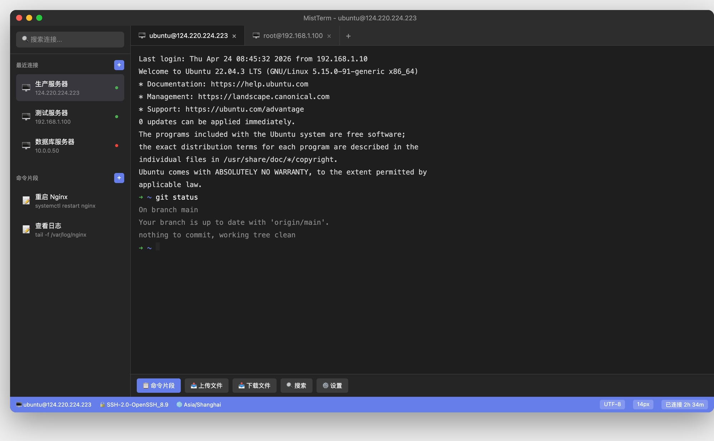
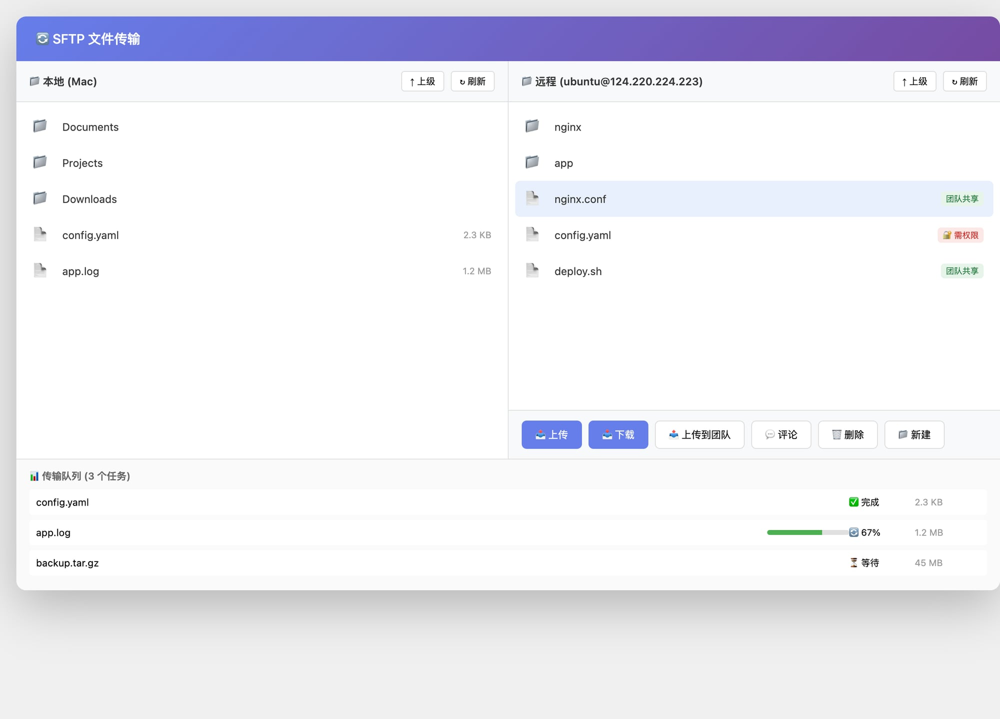
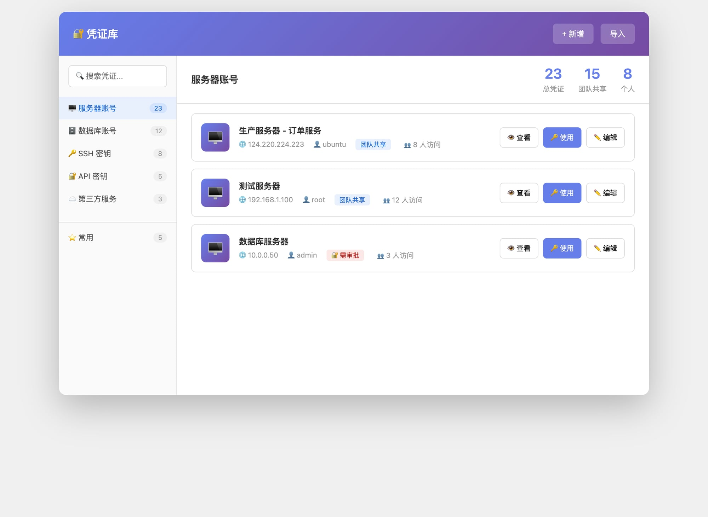
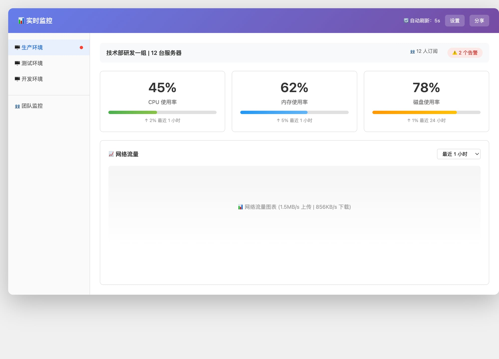
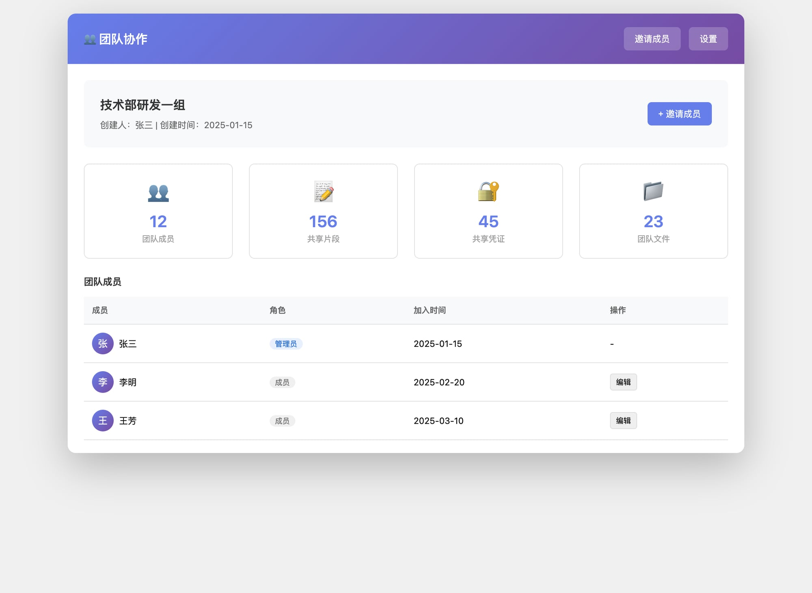
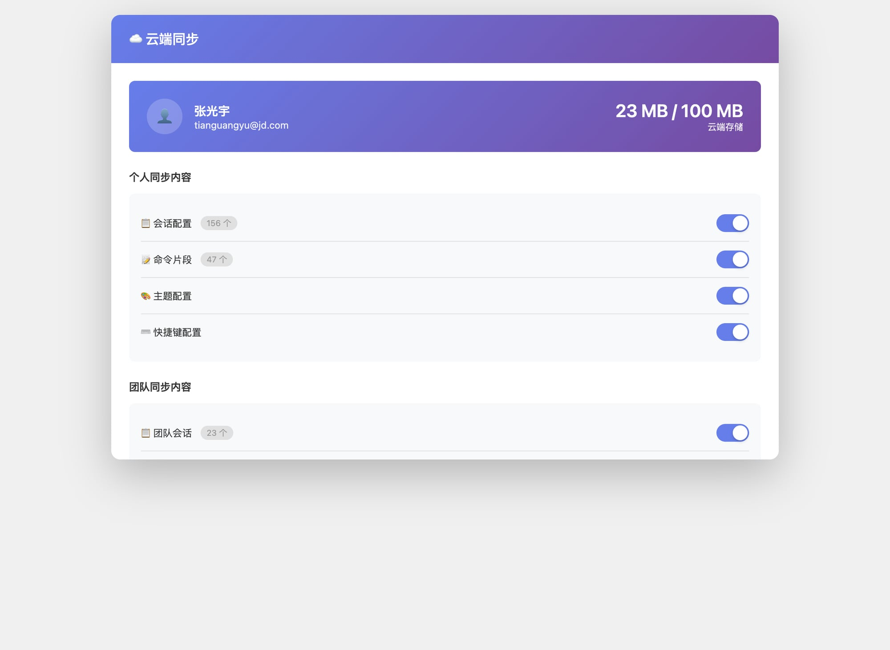
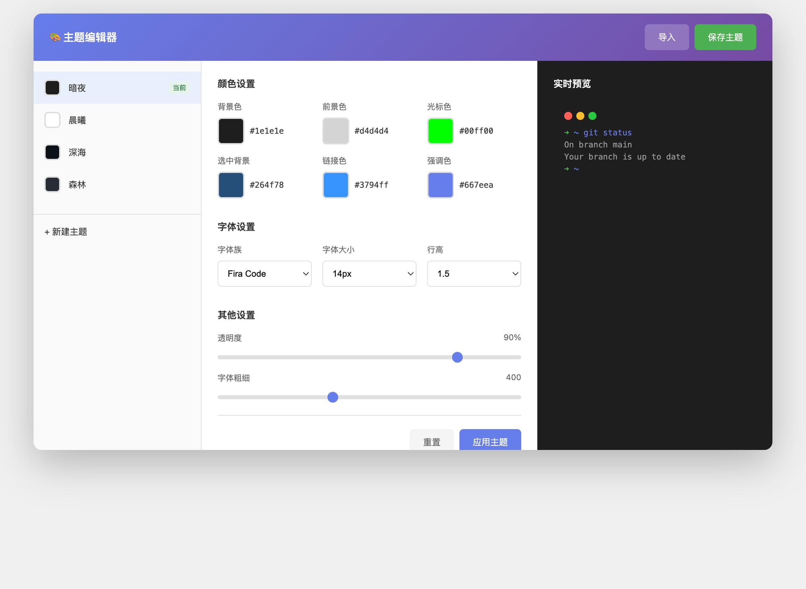

# MistTerm - 功能详细设计文档

> **文档版本**: 1.0  
> **最后更新**: 2026-04-24  
> **状态**: 目标设计  
> **作者**: 产品专家

---

## 📋 目录

- [一、产品概述](#一产品概述)
- [二、主终端界面](#二主终端界面)
- [三、命令片段管理](#三命令片段管理)
- [四、文件传输](#四文件传输)
- [五、凭证管理](#五凭证管理)
- [六、实时监控](#六实时监控)
- [七、团队协作](#七团队协作)
- [八、云端同步](#八云端同步)
- [九、主题定制](#九主题定制)
- [十、超时与异常处理](#十超时与异常处理)

---

## 一、产品概述

### 1.1 产品定位

MistTerm 是一款面向开发者和运维人员的现代化终端工具，支持 SSH 连接、SFTP 文件传输、命令片段管理、团队协作等功能。

### 1.2 核心功能

| 功能模块 | 核心价值 | 优先级 |
|---------|---------|--------|
| 命令片段管理 | 减少重复输入，提升操作效率 | P0 |
| SFTP 文件传输 | 无需切换工具，文件传输更高效 | P0 |
| 实时监控面板 | 可视化服务器状态，快速发现问题 | P0 |
| 云端同步 | 跨设备无缝切换，支持远程办公 | P1 |
| 团队协作 | 共享配置和权限，降低沟通成本 | P1 |
| 主题定制 | 个性化工作环境，提升使用舒适度 | P2 |

### 1.3 用户场景

```
场景 1：日常运维
- 快速连接服务器
- 使用命令片段执行常用操作
- 监控服务器状态

场景 2：文件传输
- 上传配置文件到服务器
- 下载日志文件到本地
- 批量传输多个文件

场景 3：团队协作
- 共享服务器账号和凭证
- 共享命令片段和脚本
- 团队统一监控告警
```

---

## 二、主终端界面

### 2.1 功能说明

主终端界面是 MistTerm 的核心界面，提供 SSH 连接、命令执行、多标签管理等功能。

### 2.2 原型图



### 2.3 界面布局

```
┌─────────────────────────────────────────────────────────────────────┐
│  [● ○ □]  MistTerm - ubuntu@124.220.224.223              [窗口控制] │
├──────────┬──────────────────────────────────────────────────────────┤
│ 🔍搜索   │ [🖥️ ubuntu@124.220.224.223 ×] [🖥️ root@192.168.1.100 ×] [+]│
├──────────┤                                                          │
│ 📁最近连接│                                                          │
│   🖥️生产  │                    终端区域                             │
│   🖥️测试  │                                                          │
│   🖥️数据库 │  Last login: Thu Apr 24 08:45:32 2026                  │
│          │  ➜ ~ git status                                          │
│ 📝命令片段│  On branch main                                          │
│   📝重启  │  nothing to commit                                       │
│   📝查看  │  ➜ ~ █                                                   │
│          │                                                          │
│          │  [📋命令片段] [📤上传] [📥下载] [🔍搜索] [⚙️设置]        │
├──────────┼──────────────────────────────────────────────────────────┤
│ 🖥️服务器 │ 🔒SSH-2.0  |  🌐Asia/Shanghai  |  UTF-8 | 14px | 2h34m  │
└──────────┴──────────────────────────────────────────────────────────┘
```

### 2.4 设计规格

#### 窗口整体

| 元素 | 规格 |
|-----|------|
| 窗口尺寸 | 1400px × 800px（默认） |
| 最小尺寸 | 800px × 600px |
| 圆角 | 12px |
| 阴影 | 0 20px 60px rgba(0,0,0,0.4) |

#### 标题栏

| 元素 | 规格 | 说明 |
|-----|------|------|
| 背景色 | #2d2d2d | 深灰色 |
| 高度 | 36px | 固定高度 |
| 窗口控制按钮 | 12px × 12px 圆形 | 红#ff5f56、黄#ffbd2e、绿#27c93f |
| 标题文字 | 13px，#999 | 居中显示 |
| 标题格式 | `{应用名} - {用户}@{主机}` | 如：MistTerm - ubuntu@124.220.224.223 |

#### 侧边栏

| 元素 | 规格 | 说明 |
|-----|------|------|
| 宽度 | 240px（可拖拽调整，范围 180-400px） | 默认 240px |
| 背景色 | #252526 | 深灰色 |
| 分隔线 | 1px，#3c3c3c | 右侧边框 |

**搜索框：**
| 元素 | 规格 |
|-----|------|
| 高度 | 36px |
| 内边距 | 8px 12px |
| 背景色 | #3c3c3c |
| 文字颜色 | #fff |
| 占位符 | #888 |
| 圆角 | 6px |

**连接列表项：**
| 元素 | 规格 | 悬停效果 | 选中效果 |
|-----|------|---------|---------|
| 高度 | 44px | 背景#2a2d31 | 背景#37373d |
| 内边距 | 10px 12px | 文字不变 | 文字#fff |
| 圆角 | 6px | - | - |
| 间距 | 4px | - | - |

**连接状态指示：**
| 状态 | 颜色 | 说明 |
|-----|------|------|
| 在线 | #4CAF50（绿色） | 最近 5 分钟内有活动 |
| 离线 | #f44336（红色） | 超过 5 分钟无活动或未连接 |
| 大小 | 6px × 6px 圆形 | 右侧显示 |

#### 标签栏

| 元素 | 规格 | 说明 |
|-----|------|------|
| 背景色 | #2d2d2d | 与标题栏一致 |
| 分隔线 | 1px，#3c3c3c | 底部边框 |
| 标签高度 | 40px | 固定高度 |

**标签样式：**
| 状态 | 背景色 | 文字颜色 | 说明 |
|-----|--------|---------|------|
| 非激活 | #2d2d2d | #999 | 普通标签 |
| 激活 | #1e1e1e | #fff | 当前标签 |
| 悬停 | #3c3c3c | #fff | 鼠标悬停 |

**标签内容：**
| 元素 | 格式 | 说明 |
|-----|------|------|
| 图标 | 🖥️ | 固定 SSH 图标 |
| 文字 | `{用户}@{主机}` | 如：ubuntu@124.220.224.223 |
| 关闭按钮 | × | 14px，悬停显示 |

**新建标签按钮：**
| 元素 | 规格 |
|-----|------|
| 位置 | 标签栏最右侧 |
| 文字 | + |
| 颜色 | #999 |
| 悬停 | #fff |

#### 终端区域

| 元素 | 规格 | 说明 |
|-----|------|------|
| 背景色 | #1e1e1e | 深色主题 |
| 内边距 | 16px | 四周等距 |
| 字体族 | SF Mono / Fira Code / monospace | 优先级递减 |
| 字体大小 | 14px（可调整，范围 10-24px） | 默认 14px |
| 行高 | 1.5 | 固定行高 |

**终端文字颜色：**
| 元素 | 颜色 | 说明 |
|-----|------|------|
| 提示符 | #4CAF50（绿色） | ➜ |
| 路径 | #667eea（紫色） | ~ |
| 命令 | #fff（白色） | git status |
| 输出 | #888（灰色） | 命令输出内容 |
| 光标 | #d4d4d4（白色） | 闪烁方块 |

**光标动画：**
```css
@keyframes blink { 50% { opacity: 0; } }
动画时长：1s
循环：infinite
```

#### 快捷操作栏

| 元素 | 规格 | 说明 |
|-----|------|------|
| 背景色 | #252526 | 与侧边栏一致 |
| 高度 | 44px | 固定高度 |
| 分隔线 | 1px，#3c3c3c | 顶部边框 |
| 按钮间距 | 8px | 水平间距 |

**按钮样式：**
| 状态 | 背景色 | 文字颜色 | 说明 |
|-----|--------|---------|------|
| 普通 | #3c3c3c | #fff | 普通按钮 |
| 主要 | #667eea | #fff | 命令片段按钮 |
| 悬停 | #4c4c4c | #fff | 鼠标悬停 |
| 高度 | 32px | - |
| 内边距 | 6px 12px | - |
| 圆角 | 4px | - |

#### 状态栏

| 元素 | 规格 | 说明 |
|-----|------|------|
| 背景色 | #667eea（主色） | 紫色渐变 |
| 高度 | 28px | 固定高度 |
| 文字颜色 | #fff | 白色 |
| 文字大小 | 11px | 小号文字 |

**状态栏内容（从左到右）：**

| 区域 | 内容 | 格式 |
|-----|------|------|
| 左侧 | 服务器信息 | 🖥️ {用户}@{主机} |
| 左侧 | SSH 版本 | 🔒 SSH-2.0-{版本} |
| 左侧 | 时区 | 🌐 {时区} |
| 右侧 | 编码 | UTF-8（徽章） |
| 右侧 | 字体大小 | 14px（徽章） |
| 右侧 | 连接时长 | 已连接 {小时}h {分钟}m（徽章） |

**状态徽章：**
| 元素 | 规格 |
|-----|------|
| 背景色 | rgba(255,255,255,0.2) |
| 内边距 | 2px 8px |
| 圆角 | 4px |
| 文字大小 | 11px |

### 2.5 交互说明

#### 侧边栏交互

| 操作 | 元素 | 效果 | 后续动作 |
|-----|------|------|---------|
| 点击 | 搜索框 | 聚焦，显示光标 | 可输入搜索关键词 |
| 输入 | 搜索框 | 实时过滤列表 | 匹配名称或主机名 |
| 点击 | 连接项 | 背景变深色 | 如果未连接则自动连接 |
| 点击 | 连接项（已激活） | 无变化 | 已在当前标签打开 |
| 右键 | 连接项 | 弹出上下文菜单 | 见下方上下文菜单 |
| 点击 | + 按钮（最近连接） | 弹出新建连接弹窗 | 填写服务器信息 |
| 点击 | + 按钮（命令片段） | 弹出新建片段弹窗 | 填写片段信息 |

#### 标签栏交互

| 操作 | 元素 | 效果 | 后续动作 |
|-----|------|------|---------|
| 点击 | 非激活标签 | 变为激活标签 | 切换终端内容 |
| 点击 | × 按钮 | 关闭标签 | 如果最后一个则关闭窗口 |
| 点击 | + 按钮 | 新建标签 | 弹出连接选择器 |
| 拖拽 | 标签 | 标签移动 | 重新排序 |
| 右键 | 标签 | 弹出标签菜单 | 新建/关闭/重命名等 |

#### 终端区域交互

| 操作 | 元素 | 效果 | 后续动作 |
|-----|------|------|---------|
| 点击 | 终端区域 | 聚焦终端 | 可输入命令 |
| 输入 | 终端 | 显示命令和输出 | 执行 SSH 命令 |
| 右键 | 终端区域 | 弹出上下文菜单 | 复制/粘贴/清空等 |
| 滚轮 | 终端区域 | 滚动查看历史 | 支持回滚查看 |
| Cmd/Ctrl + C | 终端 | 中断当前命令 | 发送 SIGINT |
| Cmd/Ctrl + V | 终端 | 粘贴剪贴板内容 | 粘贴命令 |
| Cmd/Ctrl + K | 终端 | 清空屏幕 | 保留历史记录 |
| Cmd/Ctrl + W | 终端 | 关闭当前标签 | 确认提示 |

#### 快捷操作栏交互

| 操作 | 元素 | 效果 | 后续动作 |
|-----|------|------|---------|
| 点击 | 📋命令片段 | 弹出片段选择器 | 选择并执行 |
| 点击 | 📤上传文件 | 弹出文件选择器 | 选择本地文件上传 |
| 点击 | 📥下载文件 | 弹出保存位置选择 | 选择保存路径 |
| 点击 | 🔍搜索 | 弹出搜索框 | 搜索终端内容 |
| 点击 | ⚙️设置 | 打开设置面板 | 调整终端配置 |

#### 状态栏交互

| 操作 | 元素 | 效果 | 后续动作 |
|-----|------|------|---------|
| 点击 | 服务器信息 | 显示连接详情 | 弹窗显示详细信息 |
| 点击 | 连接时长 | 显示连接统计 | 弹窗显示统计信息 |
| 点击 | 字体大小徽章 | 弹出字体大小选择 | 快速调整字体 |

#### 上下文菜单

**连接项右键菜单：**
```
┌─────────────────────────┐
│ 新建标签        (Cmd+T) │
│ 在新标签组打开          │
├─────────────────────────┤
│ 编辑连接                │
│ 删除连接                │
├─────────────────────────┤
│ 复制主机地址            │
│ 复制用户名              │
└─────────────────────────┘
```

**终端区域右键菜单：**
```
┌─────────────────────────┐
│ 复制           (Cmd+C)  │
│ 粘贴           (Cmd+V)  │
│ 全选           (Cmd+A)  │
├─────────────────────────┤
│ 清空屏幕       (Cmd+K)  │
│ 清空历史记录            │
├─────────────────────────┤
│ 字体大小          14px  │
│   ├─ 放大      (Cmd+=)  │
│   └─ 缩小      (Cmd+-)  │
├─────────────────────────┤
│ 设置                    │
└─────────────────────────┘
```

**标签右键菜单：**
```
┌─────────────────────────┐
│ 新建标签        (Cmd+T) │
│ 关闭标签       (Cmd+W)  │
│ 关闭其他标签            │
│ 关闭右侧标签            │
├─────────────────────────┤
│ 重命名标签              │
│ 复制标签地址            │
└─────────────────────────┘
```

### 2.6 数据展示规则

#### 连接列表排序

```
排序规则：
1. 最近连接的排在前面（按最后连接时间倒序）
2. 在线状态优先（在线的排在前面）
3. 相同时间按名称字母排序

更新时机：
- 连接成功后立即更新
- 断开连接后更新状态
- 每 5 分钟刷新一次在线状态
```

#### 标签显示规则

```
显示内容：
- 默认：{用户}@{主机}
- 最长显示 20 个字符，超出显示省略号
- 悬停显示完整地址

状态指示：
- 正在连接：显示加载动画
- 连接失败：显示红色感叹号
- 断开连接：显示灰色断开图标
```

#### 连接时长格式

```
格式规则：
- 少于 1 小时：已连接 {分钟}m
- 1-24 小时：已连接 {小时}h {分钟}m
- 超过 24 小时：已连接 {天}d {小时}h

刷新频率：每分钟更新
```

### 2.7 状态变化

#### 连接状态变化

| 状态 | 侧边栏 | 标签 | 状态栏 | 说明 |
|-----|--------|------|--------|------|
| 初始 | 灰色圆点 | - | - | 未连接 |
| 连接中 | 黄色闪烁 | 显示加载 | 显示连接中 | 正在建立 SSH 连接 |
| 已连接 | 绿色圆点 | 正常显示 | 显示连接时长 | 连接成功 |
| 断开 | 红色圆点 | 显示断开图标 | 显示断开 | 连接断开 |
| 错误 | 红色感叹号 | 显示错误图标 | 显示错误信息 | 连接失败 |

#### 焦点状态变化

| 焦点位置 | 侧边栏 | 终端 | 状态栏 |
|---------|--------|------|--------|
| 侧边栏聚焦 | 高亮选中项 | 正常 | 正常 |
| 终端聚焦 | 正常 | 显示光标 | 正常 |
| 搜索框聚焦 | 搜索框高亮 | 正常 | 正常 |
| 无焦点 | 无高亮 | 隐藏光标 | 正常 |

### 2.1 功能说明

命令片段是用户常用的命令模板，支持变量替换、分类管理、快速调用。

### 2.2 核心功能

- 创建/编辑/删除命令片段
- 支持变量替换（`<service>`、`<port>` 等）
- 分类和标签管理
- 快捷键快速调用（Cmd/Ctrl + J）
- 团队共享和评论

### 2.3 原型图


### 2.4 设计规格

| 元素 | 规格 |
|-----|------|
| 窗口宽度 | 720px（创建弹窗） |
| 标题栏 | 64px 高，背景渐变 #667eea → #764ba2 |
| 输入框 | 44px 高，内边距 12px 16px，边框 #e0e0e0 |
| 文本域 | 最小高度 80px，字体 SF Mono 14px |
| 按钮 | 44px 高，内边距 12px 24px，圆角 8px |
| 主按钮 | 背景 #667eea，文字 #fff |
| 次要按钮 | 背景 #f5f5f5，文字 #666 |

### 2.5 交互说明

| 交互 | 说明 |
|-----|------|
| 创建片段 | 点击「+ 新建」按钮，填写信息后保存 |
| 快速调用 | 选中片段后按 Enter 或点击「运行」 |
| 搜索过滤 | 在搜索框输入关键词，实时过滤结果 |
| 团队共享 | 创建时选择共享范围，支持评论和版本 |

---

## 四、文件传输

### 3.1 功能说明

SFTP 提供本地与远程服务器之间的文件传输，支持拖拽、批量操作、断点续传。同时支持 **lrzsz 协议**，允许在终端内直接通过命令进行文件传输。

### 3.2 核心功能

**SFTP 功能：**
- 本地/远程文件浏览
- 上传/下载单文件和批量文件
- 拖拽传输
- 断点续传
- 传输队列管理
- 团队文件共享

**lrzsz 功能：**
- 支持 `rz` 命令上传文件
- 支持 `sz` 命令下载文件
- 支持批量选择文件
- 支持拖拽到终端自动上传

### 3.3 原型图



### 3.4 设计规格

| 元素 | 规格 |
|-----|------|
| 窗口尺寸 | 1200px × 700px |
| 双面板 | 左右各 50%，中间分隔线 |
| 文件列表项 | 44px 高，悬停 #f5f5f5，选中 #e8f0fe |
| 工具栏按钮 | 44px 高，主按钮 #667eea |
| 传输队列 | 120px 高，进度条 6px |

### 3.5 SFTP 传输协议

**连接建立：**
```
1. SSH 连接成功后自动建立 SFTP 子通道
2. 使用 SFTP 协议版本 3+
3. 支持 UTF-8 文件名编码
4. 自动检测服务器文件系统类型
```

**上传流程：**
```
1. 选择本地文件/文件夹
2. 拖拽到远程面板或点击「上传」按钮
3. 显示传输队列和进度
4. 支持暂停/继续/取消
5. 传输完成后刷新远程文件列表
```

**下载流程：**
```
1. 选择远程文件/文件夹
2. 拖拽到本地面板或点击「下载」按钮
3. 选择保存路径（默认上次路径）
4. 显示传输队列和进度
5. 传输完成后打开文件夹
```

**断点续传：**
```
触发条件：
- 网络中断
- 手动暂停
- 客户端关闭

恢复机制：
1. 检测已传输字节数
2. 服务器端检查文件是否存在
3. 从断点处继续传输
4. 传输完成后校验 MD5

限制：
- 仅支持文件上传/下载
- 最小断点粒度：1KB
- 最大重试次数：3 次
```

### 3.6 lrzsz 协议支持

**命令支持：**

| 命令 | 说明 | 参数 |
|-----|------|------|
| `rz` | 上传文件到服务器 | `-e` 转义控制字符<br>`-b` 二进制模式<br>`-a` ASCII 模式 |
| `sz` | 从服务器下载文件 | `-e` 转义控制字符<br>`-b` 二进制模式<br>`-a` ASCII 模式 |
| `rz -A` | 批量上传 | 显示文件选择器 |
| `sz file1 file2` | 批量下载 | 支持多个文件 |

**交互流程：**

```
上传流程 (rz):
1. 用户在终端输入：rz
2. 检测到 rz 命令，触发上传弹窗
3. 显示本地文件选择器（支持多选）
4. 用户选择文件后确认
5. 显示传输进度弹窗
6. 传输完成后终端显示结果：
   "Sending filename.txt
    100% |****************| 1234 B  00:00:01"

下载流程 (sz):
1. 用户在终端输入：sz filename.txt
2. 检测到 sz 命令，显示保存路径选择
3. 用户确认保存路径
4. 显示传输进度弹窗
5. 传输完成后终端显示结果：
   "Sending filename.txt
    100% |****************| 1234 B  00:00:01"
```

**文件拖拽上传：**
```
1. 用户拖拽文件到终端区域
2. 检测文件类型，自动选择传输模式
3. 显示上传确认弹窗
4. 自动执行 rz 命令上传文件
5. 传输完成后显示进度
```

**传输模式：**

| 模式 | 说明 | 适用场景 |
|-----|------|---------|
| ASCII 模式 | 转换换行符 | 文本文件 (.txt, .sh, .py) |
| 二进制模式 | 原样传输 | 图片、压缩包、可执行文件 |
| 自动检测 | 根据扩展名判断 | 默认模式 |

**扩展名映射：**

```
ASCII 模式：.txt .sh .py .js .html .css .md .log .conf .cfg .xml .json .yaml .yml
二进制模式：.jpg .png .gif .zip .tar .gz .rar .7z .exe .dll .so .bin .pdf .doc .xls
```

### 3.7 交互说明

| 交互 | 说明 |
|-----|------|
| 文件传输 | 拖拽文件或点击上传/下载按钮 |
| 批量操作 | 按住 Cmd/Ctrl 多选，右键菜单操作 |
| 队列管理 | 暂停/继续/取消传输任务 |
| 断点续传 | 传输中断后提示继续或重新开始 |
| lrzsz 上传 | 终端输入 rz 或拖拽文件到终端 |
| lrzsz 下载 | 终端输入 sz 文件名 |

---

## 五、凭证管理

### 4.1 功能说明

凭证管理支持服务器账号、数据库账号、SSH 密钥、API 密钥的安全存储和共享。

### 4.2 核心功能

- 服务器账号/数据库账号/SSH 密钥/API 密钥存储
- 加密存储（端到端加密，AES-256）
- 共享到团队，权限分级
- 审计日志（谁访问/复制/修改）
- 密钥轮换机制

### 4.3 原型图



### 4.4 设计规格

| 元素 | 规格 |
|-----|------|
| 窗口尺寸 | 1000px × 650px |
| 侧边栏 | 200px 宽，背景 #fafafa |
| 凭证卡片 | 96px 高，内边距 16px，圆角 8px |
| 图标 | 48px × 48px，渐变背景 |
| 统计数字 | 24px，600 粗体 |

### 4.5 安全机制

```
加密存储：端到端加密 (E2EE) + AES-256 + 密钥分离
访问控制：角色权限分级 + 细粒度权限 + IP 白名单
审计日志：完整记录所有访问/复制/修改操作
密钥轮换：定期提醒 + 离职触发 + 安全事件触发
双因素认证：支持 TOTP/短信/硬件密钥
```

---

## 六、实时监控

### 5.1 功能说明

实时监控面板提供服务器资源的可视化展示，包括 CPU、内存、磁盘、网络等关键指标。

### 5.2 核心功能

- CPU/内存/磁盘/网络实时监控
- 历史趋势图表（24 小时）
- 告警设置和通知
- 团队监控共享

### 5.3 原型图



### 5.4 设计规格

| 元素 | 规格 |
|-----|------|
| 窗口尺寸 | 1200px × 700px |
| 指标卡片 | 3 列网格，等宽 |
| 数值显示 | 32px，600 粗体 |
| 进度条 | 8px 高，圆角 4px |
| 图表区域 | 200px 高 |

### 5.5 监控指标

| 指标 | 刷新频率 | 告警阈值 |
|-----|---------|---------|
| CPU | 5s | > 80% 持续 5 分钟 |
| 内存 | 5s | > 90% |
| 磁盘 | 60s | > 85% |
| 网络 | 5s | > 10 MB/s |

---

## 七、团队协作

### 6.1 功能说明

团队协作支持团队共享会话配置、命令片段、文件、凭证等，以及权限管理和操作审计。

### 6.2 核心功能

- 创建/管理团队
- 成员邀请/移除
- 角色权限（管理员/高级成员/普通成员/访客）
- 共享内容管理

### 6.3 原型图



### 6.4 设计规格

| 元素 | 规格 |
|-----|------|
| 窗口尺寸 | 1000px × 650px |
| 统计卡片 | 4 列网格，等宽 |
| 表格行高 | 48px |
| 头像 | 32px 圆形 |
| 角色徽章 | 圆角 12px |

### 6.5 权限模型

```
管理员：全部权限（查看/编辑/删除/分享/执行）
高级成员：查看/编辑/执行
普通成员：查看/执行
访客：仅查看
```

---

## 八、云端同步

### 7.1 功能说明

云端同步支持用户配置、会话、命令片段等数据跨设备同步。

### 7.2 核心功能

- 账号登录和云端存储
- 自动/手动同步
- 多设备管理
- 冲突处理

### 7.3 原型图



### 7.4 设计规格

| 元素 | 规格 |
|-----|------|
| 窗口尺寸 | 900px × 600px |
| 账号卡片 | 渐变背景 #667eea → #764ba2 |
| 开关按钮 | 44px × 24px |
| 设备列表项 | 72px 高 |

### 7.5 同步内容

**个人同步：**
- 会话配置
- 命令片段
- 主题配置
- 快捷键配置

**团队同步：**
- 团队会话
- 团队片段
- 团队主题
- 团队凭证

---

## 九、主题定制

### 8.1 功能说明

主题定制支持深度个性化终端外观，包括颜色、字体、布局、动画等。

### 8.2 核心功能

- 内置主题切换
- 自定义颜色、字体、布局
- 主题预览
- 主题导入导出
- 团队主题共享

### 8.3 原型图



### 8.4 设计规格

| 元素 | 规格 |
|-----|------|
| 窗口尺寸 | 1100px × 650px |
| 侧边栏 | 250px 宽 |
| 预览区域 | 350px 宽，深色背景 |
| 颜色选择器 | 40px × 40px 色块 |

### 8.5 可定制项

- 背景色、前景色、光标色
- 选中背景、链接色、强调色
- 字体族、字体大小、行高
- 透明度、字体粗细

---

## 九、超时与异常处理

### 9.1 超时设计

#### SSH 连接超时

| 阶段 | 超时时间 | 说明 | 重试策略 |
|-----|---------|------|---------|
| DNS 解析 | 5s | 域名解析超时 | 不重试，直接报错 |
| TCP 连接 | 10s | 建立 TCP 连接超时 | 重试 1 次，间隔 2s |
| SSH 握手 | 15s | SSH 协议握手超时 | 重试 1 次，间隔 3s |
| 身份认证 | 30s | 密码/密钥认证超时 | 不重试，要求用户重新输入 |
| 子通道建立 | 10s | 建立 Shell/SFTP 通道超时 | 重试 2 次，间隔 2s |

**超时错误提示：**

```
DNS 解析失败：无法解析主机 "{hostname}"
TCP 连接超时：无法连接到 {hostname}:{port}（10s）
SSH 握手超时：服务器 {hostname} 响应太慢
认证超时：身份验证失败，请检查密码/密钥
通道建立失败：无法创建 SSH 会话
```

#### 终端会话超时

| 类型 | 超时时间 | 说明 | 处理方式 |
|-----|---------|------|---------|
| 空闲超时 | 可配置（默认 30 分钟） | 无用户输入的时间 | 保持连接，发送 keepalive |
| 会话超时 | 可配置（默认 24 小时） | 连接持续时间 | 提示用户重新连接 |
| 心跳超时 | 60s | 未收到服务器心跳 | 自动重连，最多 3 次 |

**空闲超时处理：**
```
1. 剩余 5 分钟时：弹窗提示「会话即将超时」
2. 剩余 1 分钟时：再次提示，提供「延长」按钮
3. 超时后：断开连接，显示「会话已超时」
4. 用户操作：任意操作可取消超时计时
```

#### SFTP 传输超时

| 操作 | 超时时间 | 说明 | 重试策略 |
|-----|---------|------|---------|
| 文件列表 | 10s | 获取远程文件列表 | 重试 2 次 |
| 文件上传 | 可配置（默认 300s） | 单个文件上传超时 | 支持断点续传 |
| 文件下载 | 可配置（默认 300s） | 单个文件下载超时 | 支持断点续传 |
| 文件删除 | 10s | 删除远程文件 | 重试 1 次 |
| 文件重命名 | 10s | 重命名远程文件 | 重试 1 次 |
| 目录创建 | 10s | 创建远程目录 | 重试 1 次 |

**传输超时处理：**
```
1. 超时检测：超过设定时间无进度
2. 暂停传输：自动暂停当前任务
3. 提示用户：弹窗显示「传输超时」
4. 提供选项：
   - 重试（从断点继续）
   - 取消（删除未完成文件）
   - 忽略（保留已传输部分）
```

#### lrzsz 传输超时

| 操作 | 超时时间 | 说明 | 处理方式 |
|-----|---------|------|---------|
| 协议握手 | 5s | 检测服务器是否支持 lrzsz | 不支持则提示安装 |
| 文件发送 | 可配置（默认 300s） | 单个文件传输超时 | 中断传输 |
| 确认响应 | 10s | 等待服务器确认 | 重试 3 次 |

### 9.2 异常处理

#### 连接异常

| 异常类型 | 触发条件 | 错误提示 | 用户操作 |
|---------|---------|---------|---------|
| 连接被拒绝 | TCP 连接失败 | 「连接被拒绝：{hostname} 不可达」 | 检查网络/防火墙 |
| 主机不可达 | ICMP 不可达 | 「主机不可达」 | 检查 IP 地址 |
| 认证失败 | 密码/密钥错误 | 「认证失败：请检查凭据」 | 重新输入密码 |
| 主机密钥验证失败 | SSH 密钥不匹配 | 「主机密钥已改变，可能存在安全风险」 | 更新密钥或取消 |
| 协议版本不支持 | SSH 版本过低 | 「不支持的 SSH 协议版本」 | 升级服务器 SSH |
| 连接被重置 | 服务器主动断开 | 「连接被重置」 | 重新连接 |
| 网络断开 | 网络中断 | 「网络断开」 | 检查网络连接 |

#### 终端异常

| 异常类型 | 触发条件 | 错误提示 | 用户操作 |
|---------|---------|---------|---------|
| 终端大小调整失败 | 窗口调整失败 | 「终端大小调整失败」 | 手动调整 |
| 字符编码错误 | 无法解码字符 | 「编码错误：{charset}」 | 切换编码 |
| 命令执行超时 | 命令运行过久 | 「命令执行超时」 | 中断命令 |
| 终端缓冲区溢出 | 输出过多 | 「缓冲区已满，已清理旧内容」 | 清理历史 |

#### SFTP 异常

| 异常类型 | 触发条件 | 错误提示 | 用户操作 |
|---------|---------|---------|---------|
| 文件不存在 | 访问不存在的文件 | 「文件不存在：{path}」 | 检查路径 |
| 权限不足 | 无访问权限 | 「权限不足：无法访问 {path}」 | 检查权限 |
| 磁盘空间不足 | 上传时磁盘满 | 「磁盘空间不足」 | 清理空间 |
| 文件被占用 | 文件正在使用 | 「文件被占用：{path}」 | 关闭文件 |
| 传输中断 | 网络中断 | 「传输中断」 | 断点续传 |
| 文件名过长 | 超过系统限制 | 「文件名过长」 | 缩短文件名 |

#### lrzsz 异常

| 异常类型 | 触发条件 | 错误提示 | 用户操作 |
|---------|---------|---------|---------|
| 服务器不支持 | 无 lrzsz 命令 | 「服务器不支持 lrzsz」 | 安装 lrzsz |
| 传输协议错误 | 数据校验失败 | 「传输协议错误」 | 重新传输 |
| 文件损坏 | MD5 校验失败 | 「文件损坏」 | 重新传输 |
| 磁盘空间不足 | 接收时磁盘满 | 「磁盘空间不足」 | 清理空间 |

### 9.3 错误提示规范

**错误弹窗：**
```
┌─────────────────────────────────────┐
│  ⚠️  连接失败                       │
├─────────────────────────────────────┤
│                                     │
│  无法连接到服务器：                   │
│  192.168.1.100:22                   │
│                                     │
│  错误信息：                          │
│  Connection timed out (10s)         │
│                                     │
│  建议操作：                          │
│  1. 检查网络连接                     │
│  2. 确认服务器已启动                 │
│  3. 检查防火墙设置                   │
│                                     │
│  [重试]  [取消]  [查看详情]         │
└─────────────────────────────────────┘
```

**状态栏错误提示：**
```
正常：🖥️ ubuntu@124.220.224.223 | 🔒 SSH-2.0 | 已连接 2h34m
错误：🖥️ ubuntu@124.220.224.223 | ❌ 连接失败 | [重试]
警告：🖥️ ubuntu@124.220.224.223 | ⚠️ 连接不稳定 | [查看详情]
```

### 9.4 日志记录

**连接日志：**
```
[2026-04-24 08:45:32] 开始连接：192.168.1.100:22
[2026-04-24 08:45:33] DNS 解析成功：192.168.1.100
[2026-04-24 08:45:34] TCP 连接成功
[2026-04-24 08:45:35] SSH 握手完成：SSH-2.0-OpenSSH_8.9
[2026-04-24 08:45:36] 认证成功：publickey
[2026-04-24 08:45:37] 通道建立成功：shell
[2026-04-24 08:45:37] 连接完成，耗时 5s
```

**传输日志：**
```
[2026-04-24 08:50:12] 开始上传：/local/file.txt -> /remote/file.txt
[2026-04-24 08:50:13] 文件大小：1234 B
[2026-04-24 08:50:15] 传输完成：1234 B / 1234 B (100%)
[2026-04-24 08:50:15] MD5 校验：通过
[2026-04-24 08:50:15] 耗时：3s, 速度：411 B/s
```

---

## 十、设计资源

### 10.1 颜色规范

| 用途 | 颜色值 |
|-----|--------|
| 主色渐变 | #667eea → #764ba2 |
| 选中背景 | #e8f0fe |
| 悬停背景 | #f5f5f5 |
| 边框 | #e0e0e0 |
| 文字主色 | #333 |
| 文字次色 | #666 |
| 文字辅助色 | #999 |

### 10.2 原型图目录

```
docs/protos/
├── fragments-create.png    # 命令片段创建
├── fragments-list.png      # 命令片段列表
├── sftp-main.png           # SFTP 文件传输
├── credentials-list.png    # 凭证管理列表
├── monitor-dashboard.png   # 实时监控面板
├── team-manage.png         # 团队管理
├── sync-settings.png       # 云端同步设置
└── theme-editor.png        # 主题编辑器
```

### 10.3 变更记录

| 版本 | 日期 | 变更内容 | 作者 |
|-----|------|---------|------|
| 1.0 | 2026-04-24 | 初始版本，包含完整原型图 | 产品专家 |

---

**文档结束**

> 💡 **备注**：本文档为 MistTerm 功能设计，包含可视化原型图和设计规格，方便开发和评审。
