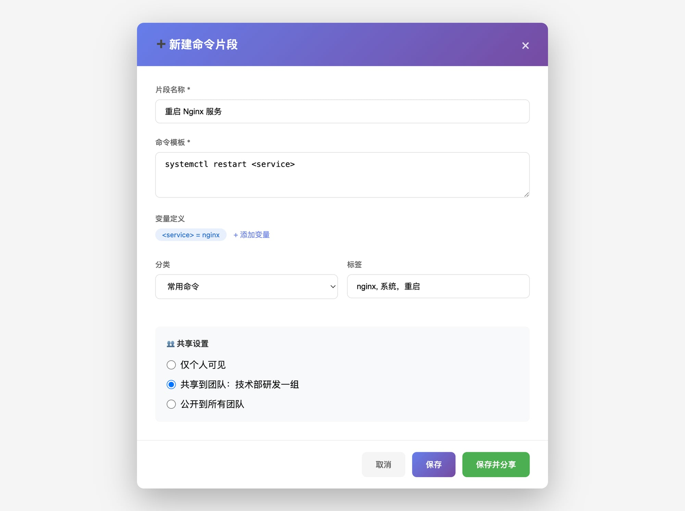
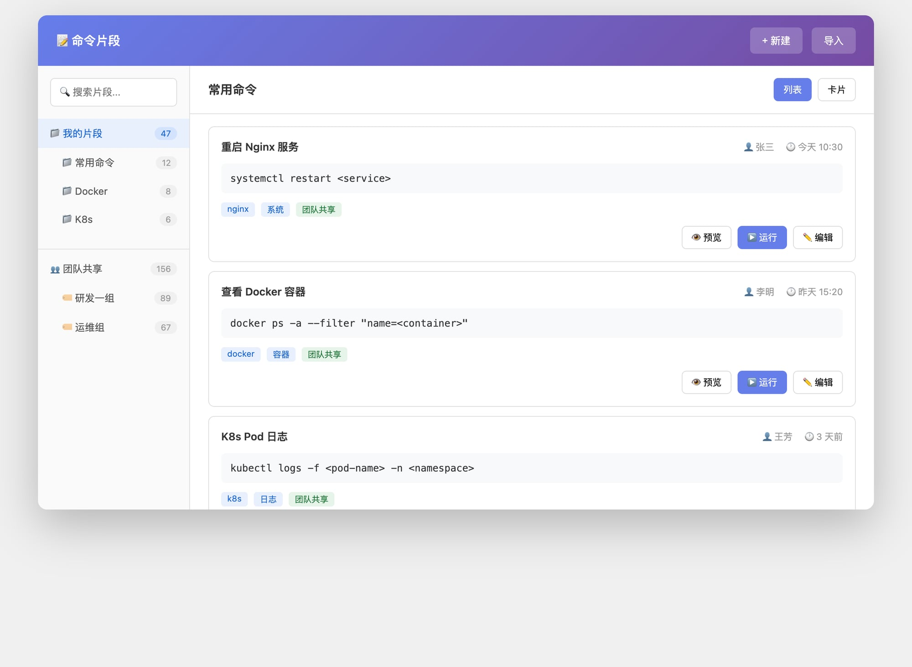

# 命令片段与分析统计

### 客户端实现对照

| 产品模块 | MVP 状态 | 实现位置 |
|---------|----------|----------|
| 个人/团队片段、变量、scope | ✅ | `FragmentManager`、`TeamFragmentCache` |
| 个人 Top5、执行统计字段 | ✅ | 片段侧栏、`FragmentStats` |
| 分析大盘（KPI + Top5 + 慢/错） | ✅ | `fragment_analytics_dialog.rs`、`fragment_analytics.rs` |
| 团队统计 API | ✅ 可选 | `GET .../fragments/analytics`；404 本地回退 |
| 片段市场 catalog | ✅ | `src/core/market/`、侧栏「市场」scope |
| 时间范围筛选（7/30/90 天） | ✅ | `FragmentAnalyticsTimeRange` |
| 区间内增量统计 | ✅ | `fragment_usage_log.rs` + 执行事件 |
| 成员对比 | ✅ 本机 + 可选全团队 | 本机 `fragment_usage_events`；全团队需 `GET .../analytics/members`（§三 P1） |
| JSON 导出 | ✅ | 分析弹窗 → 剪贴板 |
| 智能推荐（命令历史） | ✅ | `fragment_recommendations.rs`、分析弹窗 |
| 效率报告 Markdown | ✅ | 分析弹窗「效率报告」→ 剪贴板 |
| 效率报告 PDF | ✅ | 分析弹窗「导出 PDF」；系统 CJK 字体 |
| 分屏树形 ≤8 + 拖放换位 | ✅ | `tab_pane.rs` `SplitNode` |
| 市场 catalog 分页 | ✅ | `cursor` +「加载更多」 |

服务端契约：[TEAM.md](../tech/TEAM.md) §三。

---

## 三、命令片段与分析统计

### 3.1 功能概述

命令片段是 MistTerm 的**核心效率功能**，将常用命令存起来一键执行。配合**分析统计**能力，让团队发现高频命令、优化操作习惯、量化效率提升。

**核心价值**：
```
✅ 效率提升：常用命令一键执行，每周节省 2-3 小时
✅ 知识沉淀：团队经验共享，新人快速上手
✅ 数据驱动：用数据发现高频命令和错误模式
✅ 智能推荐：自动推荐片段优化建议
```

---

### 3.2 命令片段基础功能

#### 3.2.1 功能说明

命令片段是用户常用的命令模板，支持变量替换、分类管理、快速调用。

#### 3.2.2 核心功能

| 功能 | 说明 |
|-----|------|
| 创建/编辑/删除 | 管理个人和团队片段 |
| 变量替换 | 支持 `<service>`、`<port>` 等变量 |
| 分类和标签 | 按场景/环境/用途分类 |
| 快捷键调用 | Cmd/Ctrl + J 快速调用 |
| 团队共享 | 创建时选择共享范围，支持评论和版本 |

#### 3.2.3 原型图




#### 3.2.4 设计规格

| 元素 | 规格 |
|-----|------|
| 窗口宽度 | 720px（创建弹窗） |
| 标题栏 | 64px 高，背景渐变 #667eea → #764ba2 |
| 输入框 | 44px 高，内边距 12px 16px，边框 #e0e0e0 |
| 文本域 | 最小高度 80px，字体 SF Mono 14px |
| 按钮 | 44px 高，内边距 12px 24px，圆角 8px |
| 主按钮 | 背景 #667eea，文字 #fff |
| 次要按钮 | 背景 #f5f5f5，文字 #666 |

#### 3.2.5 交互说明

| 交互 | 说明 |
|-----|------|
| 创建片段 | 点击「+ 新建」按钮，填写信息后保存 |
| 快速调用 | 选中片段后按 Enter 或点击「运行」 |
| 搜索过滤 | 在搜索框输入关键词，实时过滤结果 |
| 团队共享 | 创建时选择共享范围，支持评论和版本 |

---

### 3.3 命令分析统计（核心亮点）

#### 3.3.1 功能概述

**为什么需要命令分析？**

| 用户痛点 | MistTerm 解决方案 |
|---------|------------------|
| ❌ 不知道团队常用哪些命令 | ✅ 团队 Top 命令统计 |
| ❌ 不知道哪些命令执行最频繁 | ✅ 执行频率分析 |
| ❌ 不知道哪些操作容易出错 | ✅ 错误率分析 |
| ❌ 新人不知道团队最佳实践 | ✅ 最佳实践推荐 |
| ❌ 无法量化效率提升 | ✅ 效率报告生成 |

**竞品对比**：

| 功能 | iTerm2 | Termius | Xshell | **MistTerm** |
|-----|--------|---------|--------|-------------|
| 命令历史 | ✅ 本地 | ✅ 本地 | ✅ 本地 | ✅ 本地 + 团队 |
| 执行统计 | ❌ | ⚠️ 基础 | ❌ | ✅ **完整** |
| 耗时分析 | ❌ | ❌ | ❌ | ✅ **独有** |
| 错误分析 | ❌ | ❌ | ❌ | ✅ **独有** |
| 团队统计 | ❌ | ✅ 付费 | ❌ | ✅ **差异化** |
| 智能推荐 | ❌ | ❌ | ❌ | ✅ **独有** |

#### 3.3.2 核心功能模块

```
┌─────────────────────────────────────────────────────────────┐
│                    命令分析仪表盘                            │
├──────────────────┬──────────────────┬───────────────────────┤
│   个人统计        │    团队统计       │      智能推荐         │
├──────────────────┼──────────────────┼───────────────────────┤
│ • 执行频率        │ • 团队 Top 命令    │ • 片段优化建议        │
│ • 耗时分析        │ • 团队错误率      │ • 新片段推荐          │
│ • 错误分析        │ • 团队活跃度      │ • 最佳实践            │
│ • 服务器分布      │ • 成员对比        │ • 效率报告            │
└──────────────────┴──────────────────┴───────────────────────┘
```

#### 3.3.3 仪表盘设计

```
┌─────────────────────────────────────────────────────────────┐
│  📊 命令分析仪表盘                              [本周 ▼]    │
├─────────────────────────────────────────────────────────────┤
│  ┌─────────────┐ ┌─────────────┐ ┌─────────────┐           │
│  │  总执行次数  │ │  平均耗时   │ │  错误率     │           │
│  │    1,234    │ │   2.3s      │ │    3.2%     │           │
│  │  ↑ 15%      │ │  ↓ 0.5s     │ │  ↓ 1.2%     │           │
│  └─────────────┘ └─────────────┘ └─────────────┘           │
├─────────────────────────────────────────────────────────────┤
│  🏆 我的 Top 5 命令                    团队 Top 5 命令          │
│  ──────────────────────────────  ────────────────────────── │
│  1. docker ps          156 次   1. docker restart   500 次  │
│  2. git pull           120 次   2. kubectl apply   320 次  │
│  3. kubectl logs       98 次    3. nginx reload    280 次  │
│  4. tail -f            85 次    4. git pull        250 次  │
│  5. nginx reload       72 次    5. docker ps       200 次  │
├─────────────────────────────────────────────────────────────┤
│  ⏱️ 耗时分析                          ❌ 错误分析            │
│  ┌──────────────────────────────┐  ┌──────────────────────┐ │
│  │ ████████░░  docker    3.2s   │  │ ████░░░░  kubectl 12% │ │
│  │ ██████░░░░  git       2.1s   │  │ ██░░░░░░  ssh     5%  │ │
│  │ ████░░░░░░  kubectl   1.8s   │  │ █░░░░░░░  docker  2%  │ │
│  │ ██░░░░░░░░  nginx     0.9s   │  │ ░░░░░░░░  git     1%  │ │
│  └──────────────────────────────┘  └──────────────────────┘ │
├─────────────────────────────────────────────────────────────┤
│  💡 智能推荐                                                │
│  ────────────────────────────────────────────────────────── │
│  • 建议将「docker restart」添加到命令片段（已执行 500 次）    │
│  • 发现新的高效命令「deploy.sh」（张三使用，成功率 98%）     │
│  • 注意：「kubectl delete」错误率 15%，建议检查参数         │
└─────────────────────────────────────────────────────────────┘
```

#### 3.3.4 统计维度

**个人统计**：

| 维度 | 说明 | 示例 |
|-----|------|------|
| **执行频率** | 命令执行次数排名 | `docker ps` 156 次 |
| **耗时分析** | 命令平均执行时间 | `git pull` 平均 3.2s |
| **错误率** | 命令失败次数占比 | `kubectl apply` 12% 失败 |
| **服务器分布** | 各服务器命令分布 | 生产环境 60%，测试 40% |
| **时间段** | 活跃时间段分析 | 14:00-16:00 最活跃 |

**团队统计**：

| 维度 | 说明 | 示例 |
|-----|------|------|
| **团队 Top 命令** | 团队最常用命令 | `docker restart` 500 次 |
| **团队错误率** | 各命令团队错误率 | `kubectl delete` 15% 失败 |
| **成员活跃度** | 成员执行次数排名 | 张三 200 次，李四 150 次 |
| **团队效率** | 团队整体效率趋势 | 本周效率提升 20% |
| **最佳实践** | 团队推荐命令 | 张三的 `deploy.sh` 被采用 50 次 |

#### 3.3.5 智能推荐引擎

**片段优化建议**：
```
检测到以下命令执行频率高，建议添加到片段：

1. docker restart -t 30 <container>
   执行次数：65 次/周
   预计节省：10.8 分钟/周
   [一键添加到片段]

2. kubectl logs -f deployment/<name>
   执行次数：58 次/周
   预计节省：9.7 分钟/周
   [一键添加到片段]
```

**团队最佳实践**：
```
💡 发现团队优质片段：

1. 「张三 - 安全部署脚本」
   使用次数：50 次（团队）
   成功率：98%
   平均耗时：比手动操作快 3 倍
   [采用此片段]

2. 「李四 - 日志分析脚本」
   使用次数：35 次（团队）
   评价：★★★★★
   [采用此片段]
```

**效率报告**：
```
📊 本周效率报告

总执行次数：1,234 次
使用片段：456 次（37%）
节省时间：约 2.5 小时

团队排名：
1. 张三 - 节省 1.2 小时
2. 李四 - 节省 0.8 小时
3. 你 - 节省 0.5 小时

🎯 下周目标：
将片段使用率提升到 50%，预计再节省 1 小时
```

#### 3.3.6 错误分析示例

```
⚠️ 「kubectl delete」错误率 15%（15/100 次）
   常见错误：
   1. 资源不存在（40%）
   2. 权限不足（30%）
   3. 依赖未清理（20%）
   建议：检查命令参数，或创建安全的删除脚本
```

#### 3.3.7 耗时分析示例

```
命令耗时分析（平均）
────────────────────────────────
命令                    平均耗时    最慢耗时    最快耗时
────────────────────────────────────────────────────
docker build            45.2s       120s        15s
git pull                 3.2s        10s         1s
kubectl apply            2.8s         8s         1s
docker ps                0.5s         2s         0.1s
ssh 连接                  1.2s         5s         0.5s

⚠️ 发现慢命令：「docker build」平均 45.2 秒
   建议：考虑使用构建缓存或并行构建
```

---

### 3.4 技术实现方案

#### 3.4.1 数据存储

```rust
// 命令历史记录
struct CommandHistory {
    id: String,
    command: String,
    server: String,
    session_id: String,
    start_time: DateTime,
    end_time: DateTime,
    duration_ms: u64,
    exit_code: i32,
    output_size: usize,
    user_id: String,
    team_id: Option<String>,
}

// 统计数据（定期聚合）
struct CommandStats {
    command: String,
    total_count: u64,
    success_count: u64,
    fail_count: u64,
    avg_duration_ms: u64,
    min_duration_ms: u64,
    max_duration_ms: u64,
    last_executed: DateTime,
}
```

#### 3.4.2 存储策略

| 数据类型 | 存储位置 | 保留期限 | 说明 |
|---------|---------|---------|------|
| 原始历史 | 本地 SQLite | 90 天 | 详细记录 |
| 统计数据 | 本地 SQLite | 永久 | 聚合数据 |
| 团队统计 | Git 仓库 | 永久 | 团队共享 |
| 效率报告 | 本地 JSON | 1 年 | 周期性报告 |

#### 3.4.3 性能考虑

```
数据采集：
- 异步记录，不阻塞终端
- 批量写入，减少 IO
- 压缩存储，节省空间

统计分析：
- 定时聚合（每小时）
- 增量计算，不重复处理
- 缓存结果，快速响应

前端展示：
- 懒加载，分页展示
- 图表数据预计算
- 支持时间范围筛选
```

---

### 3.5 UI 设计

#### 3.5.1 入口设计

```
主界面新增「分析」入口：

┌──────────────────────────────────────────┐
│  [会话] [片段] [传输] [分析] [设置]      │
├──────────────────────────────────────────┤
│                                          │
│         分析仪表盘内容                    │
│                                          │
└──────────────────────────────────────────┘
```

#### 3.5.2 快捷入口

```
右键菜单新增：
- 查看此命令统计
- 添加到片段（基于统计推荐）

命令片段列表：
- 显示每个片段的使用次数
- 显示成功率
- 显示平均耗时
```

#### 3.5.3 通知提醒

```
智能提醒：
- 「发现高频命令，建议添加到片段」
- 「某命令错误率异常，请注意」
- 「本周效率报告已生成」
```

---

### 3.6 实现优先级与工作量

| 功能 | 优先级 | 工作量 | 说明 |
|-----|-------|--------|------|
| **命令片段基础** | | | |
| 本地片段管理 | P0 | 10 人天 | 创建/编辑/删除 |
| 变量替换 | P0 | 3 人天 | 正则实现 |
| 快捷键调用 | P0 | 5 人天 | egui 内置 |
| 团队共享（Git） | P0 | 15 人天 | Git 方案 |
| **分析统计** | | | |
| 基础数据采集 | P0 | 10 人天 | 记录命令历史 |
| 个人统计 | P0 | 15 人天 | 频率/耗时/错误 |
| 仪表盘展示 | P0 | 15 人天 | 图表展示 |
| 智能推荐 | P1 | 10 人天 | 片段优化建议 |
| 团队统计 | P1 | 15 人天 | 团队对比/最佳实践 |
| 效率报告 | P2 | 10 人天 | 周期性报告 |
| **总计** | | **93 人天** | **约 2 个月** |

---

### 3.7 产品价值

#### 3.7.1 用户价值

| 价值点 | 说明 | 量化收益 |
|-------|------|---------|
| 效率提升 | 发现高频命令，优化片段 | 每周节省 2-3 小时 |
| 错误减少 | 识别高错误率命令 | 错误率降低 50% |
| 新人培养 | 学习团队最佳实践 | 上手时间缩短 50% |
| 价值证明 | 量化 MistTerm 带来的收益 | 可展示 ROI |

#### 3.7.2 差异化竞争力

| 维度 | 竞品 | MistTerm |
|-----|------|---------|
| 基础统计 | ✅ 有 | ✅ 更完整 |
| 耗时分析 | ❌ 无 | ✅ 独有 |
| 错误分析 | ❌ 无 | ✅ 独有 |
| 团队统计 | ⚠️ 付费 | ✅ 基础免费 |
| 智能推荐 | ❌ 无 | ✅ 独有 |

---

## 总结

### 核心功能

```
✅ 命令片段（本地 + 团队共享）
✅ 命令执行统计（频率/耗时/错误）
✅ 团队对比分析
✅ 智能推荐引擎
✅ 效率报告生成
```

### 实现路线

```
Phase 1 (1.5 个月): 核心功能
├── 命令片段基础（本地 + Git 共享）
├── 基础数据采集
├── 个人统计仪表盘

Phase 2 (0.5 个月): 增强功能
├── 团队统计
├── 智能推荐
└── 效率报告
```

### 产品定位

**命令片段 + 分析统计 = MistTerm 的「效率引擎」**

- 让用户看到效率提升
- 让团队看到最佳实践
- 让产品有数据驱动的差异化竞争力

---

**设计完成**  
**建议**：作为 Phase 1 核心功能，与团队共享同步开发
